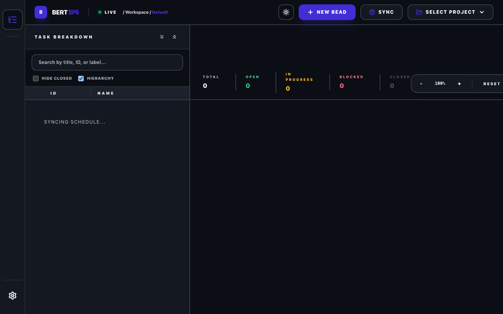
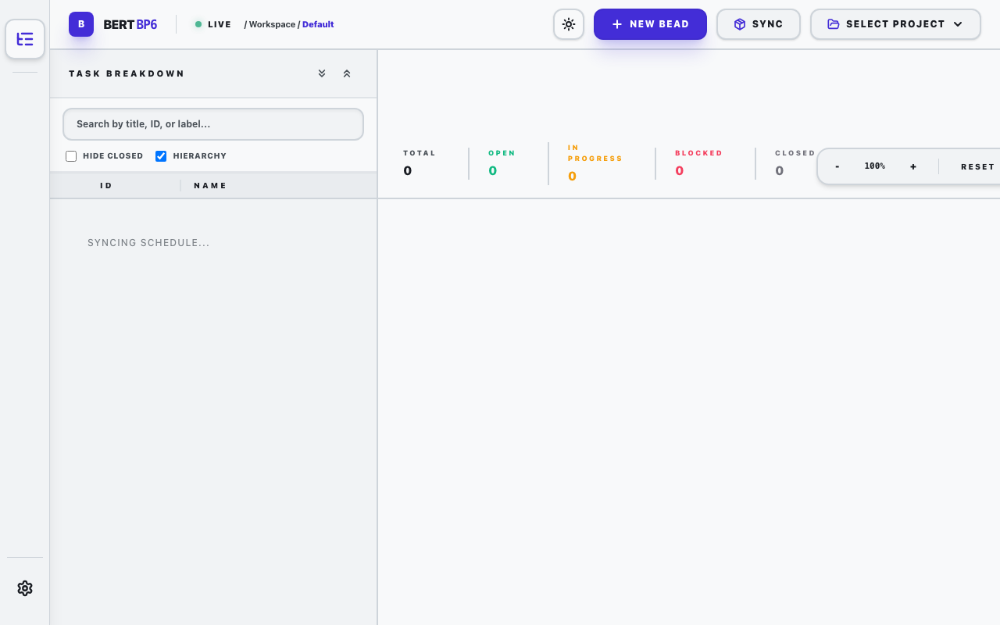

# BERT BP6 Viz

BERT BP6 Viz is a modern, high-performance desktop application for
visualizing project schedules through a Task Breakdown (WBS) and
an interactive Gantt Chart. Built with Tauri, React, and Tailwind
CSS, it provides a seamless and responsive experience for managing
complex projects.



## Features

- **Integrated WBS & Gantt View**: See your task hierarchy and schedule side-by-side with synchronized scrolling.
- **Critical Path Analysis**: Automatically identifies and highlights the critical path in your project schedule.
- **Dependency Management**: Visualizes "blocks" and "parent-child" relationships between tasks (beads).
- **Status Tracking**: Easily monitor task progress with color-coded status indicators (Open, In Progress, Blocked, Closed).
- **Dark/Light Modes**: Switch between themes for your preferred working environment.
- **Fast & Lightweight**: Leverages Rust-powered Tauri backend for minimal resource usage.
- **Search & Filter**: Quickly find tasks by ID, title, owner, or labels.

## Screenshots

### Light Mode


## Getting Started

### Prerequisites

- [Node.js](https://nodejs.org/) (v18+)
- [Rust](https://www.rust-lang.org/) (latest stable)
- [Tauri Prerequisites](https://tauri.app/v1/guides/getting-started/prerequisites)

### Installation

1. Clone the repository:
   ```bash
   git clone https://github.com/your-repo/bert-viz.git
   cd bert-viz
   ```

2. Install dependencies:
   ```bash
   npm install
   ```

### Development

Start the development server:
```bash
npm run tauri dev
```

### Building

Build the production application:
```bash
npm run tauri build
```

## Tech Stack

- **Frontend**: React, TypeScript, Tailwind CSS, Lucide React
- **Backend**: Rust, Tauri
- **Build Tool**: Vite

## License

This project is licensed under the Apache License, Version 2.0. See the [LICENSE.TXT](LICENSE.TXT) file for details.
