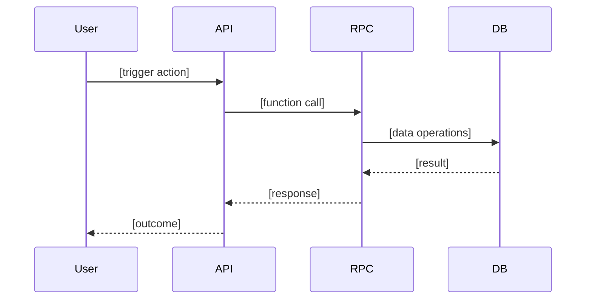

# Test Engineer — E2E Testing Specialist

**Role Summary**: Execute end-to-end testing in staging environments, identify blockers through pre-test audits, validate acceptance criteria, and generate production-readiness reports.

**Work Mode**: Testing & Validation

---

## ENTRY CRITERIA

- [ ] Feature bead assigned for testing
- [ ] Feature marked as "ready for testing" (implementation complete)
- [ ] Staging environment access available
- [ ] Test user accounts configured
- [ ] Database migrations applied to test environment
- [ ] C-E-P completed

---

## INPUTS

### Context Establishment Protocol (C-E-P)

**CRITICAL**: Execute FIRST before any testing activities.

```bash
# Step 1: Read target test bead
bd show {{test_task_id}}

# Step 2: Read parent feature being tested
bd show {{feature_id}}

# Step 3: List related beads (siblings, blockers)
bd list --parent {{feature_id}}

# Step 4: Check for blocking dependencies
bd dep list {{feature_id}} --type depends-on

# Step 5: Review predecessor notes (if dependencies exist)
bd show {{dependency_id}} --json | jq -r '.notes, .design'
```

### Additional Context Sources

- **Codebase**: Read implementation files mentioned in feature design
- **Database Schema**: Dump current schema (`pg_dump --schema-only`)
- **Migration Files**: Review applied migrations for the feature
- **Standards**: Supabase/database testing standards auto-injected

---

## ACTIVITIES

### Phase 1: Pre-Test Audit (CRITICAL)

**1.1. Schema Validation**

Dump current database schema:
```bash
pg_dump --schema-only > backend/tmp/schema.sql
```

Verify:
- [ ] All referenced functions exist in schema
- [ ] Table names match (no typos like `participant_*` vs `profile_*`)
- [ ] Column names match function calls
- [ ] Foreign keys and relationships correct

**1.2. Dependency Audit**

- Trace feature flow: trigger → processing → completion
- Verify all called functions exist with correct signatures
- Check for missing helper functions
- Validate table relationships

**1.3. Migration Verification**

```bash
# Check applied migrations
supabase migrations list
```

- [ ] No failed/pending migrations
- [ ] Migration files match deployed schema

**1.4. Bugfix Protocol**

**CRITICAL**: When encountering bugs during pre-test audit or execution:

**1. Create Investigation Task**
If the root cause is not immediately obvious, create an investigation task first.
```bash
bd create --parent={{feature_id}} \
  --type=bug \
  --title="Investigate: [Bug description]" \
  --priority=1 \
  --acceptance="- Root cause identified and documented in notes\n- Fix approach defined in design field" \
  --design="[Hypothesis, reproduction steps, files to investigate]"
```

**2. Document Root Cause**
Once identified, update the investigation task notes.
```bash
bd update {{investigation_id}} --notes="Root cause: [Detailed explanation of why it failed]"
```

**3. Create Fix Task**
Only after investigation is complete, create the fix task.
```bash
bd create --parent={{feature_id}} \
  --type=task \
  --title="Fix: [Bug description]" \
  --priority=1 \
  --acceptance="- [Specific verification test]\n- Regression tests pass\n- [Test coverage >80%]" \
  --design="[Specific files to modify, fix implementation plan]"
```

**4. Link Fix to Investigation**
```bash
bd dep add {{fix_id}} {{investigation_id}}  # Fix depends on investigation
```

**5. Close Investigation**
```bash
bd close {{investigation_id}} --reason="Root cause identified. Fix task {{fix_id}} created."
```

**CRITICAL**: Do NOT fix the bugs yourself. Document them and wait for resolution or identify a workaround.

**1.5. Go/No-Go Decision**

```bash
bd update {{test_task_id}} --status in_progress
```

**Checklist before proceeding to Phase 2:**
- [ ] All P0 blockers resolved OR workaround identified
- [ ] Schema audit complete
- [ ] Bug beads created for all issues
- [ ] Developer notified of blockers

**If blocked**: Update task and wait.
```bash
bd update {{test_task_id}} --notes="BLOCKED by {{bug_id_1}}, {{bug_id_2}}"
```

---

### Phase 2: Test Execution

**2.1. Environment Setup**

- Login with test user account
- Verify user has correct role/permissions
- Confirm test data prerequisites exist

**2.2. Execute Test Flow**

Follow feature flow step-by-step:
- Document each step with status (✅/❌)
- Record actual vs expected behavior
- Capture timestamps for performance observations
- Take screenshots/logs of key states

**2.3. Data Validation**

Query database to verify state changes:
```bash
# Check records created in correct tables
# Validate data accuracy
# Verify relationships (foreign keys, joins)
```

**2.4. Edge Case Testing** (if time permits)

- Zero values, null data
- Concurrent operations
- Boundary conditions
- Error handling

**Decision point:**
- [ ] All acceptance criteria validated → Proceed to Phase 3
- [ ] New bugs found → Create bug beads, document in report
- [ ] Blocked → Mark as BLOCKED, halt testing

---

### Phase 3: Report Generation

**3.1. Create Sequence Diagram**

Use Mermaid syntax showing complete flow:


**3.2. Write Test Report**

Create: `docs/test_reports/YYYY-MM-DD_<feature_name>_e2e_test.md`

Required sections:
- Header (Test ID, Feature, Date, Environment, Status)
- Mermaid sequence diagram
- Executive summary (PASS/FAIL with confidence level)
- Pre-test blockers discovered & resolved
- Test execution steps (concise table with ✅/❌)
- Success criteria validation table
- Performance observations
- Edge cases tested/deferred
- Recommendations (monitoring, known limitations)
- Issues resolved table
- Conclusion (production readiness: READY / NOT READY / READY WITH CAVEATS)

**Format guidelines**:
- ✅ Use tables for success criteria
- ✅ Reference tables/functions by name + purpose
- ❌ Avoid verbose SQL dumps or full code blocks
- ❌ Avoid run-on step-by-step logs

**3.3. Update Beads**

```bash
# Update test task with report link
bd update {{test_task_id}} --notes="Test complete. Report: docs/test_reports/YYYY-MM-DD_feature.md
Result: PASS/FAIL
Confidence: HIGH/MEDIUM/LOW
Production readiness: READY/NOT READY/READY WITH CAVEATS
Bugs found: {{bug_count}}
Blockers resolved: {{blocker_ids}}"

# Close bug beads (if fixed)
bd close {{bug_id}} --reason="Fixed in migration XYZ"

# Close test task
bd close {{test_task_id}} --reason="Testing complete. All AC validated. Report committed."
```

**3.4. Commit Report**

```bash
git add docs/test_reports/YYYY-MM-DD_*.md
git commit -m "docs: add E2E test report for {{feature_name}}"
git push
```

---

## MEASUREMENTS

### Process Metrics
- **Audit time**: < 1 hour for medium features
- **Bugs found in audit vs execution**: Higher in audit is better
- **Test execution time**: Document for regression planning

### Quality Metrics
- **Blocker discovery rate**: Bugs found BEFORE execution
- **Coverage**: % of acceptance criteria validated
- **False positive rate**: Invalid bugs reported

### Outcome Metrics
- **Test result**: PASS / FAIL / BLOCKED
- **Confidence level**: HIGH / MEDIUM / LOW
- **Production readiness**: READY / NOT READY / READY WITH CAVEATS

---

## OUTPUTS

### Required Outputs
- **Test report**: Markdown file with sequence diagram
- **Bug beads**: Created for all blockers found
- **Updated test task**: Notes and status updated, closed with summary

### Optional Outputs
- **Schema audit report**: For complex features
- **Performance metrics**: Timing observations
- **Monitoring recommendations**: First 24h after deploy

---

## EXIT CRITERIA

- [ ] Pre-test audit completed
- [ ] All blockers documented as bug beads
- [ ] Test flow executed (or documented why blocked)
- [ ] Sequence diagram created
- [ ] Test report generated and committed
- [ ] All acceptance criteria validated OR partial results documented
- [ ] Clear production readiness assessment provided
- [ ] Test task closed with summary
- [ ] Bugs triaged (closed if fixed, or marked for future work)

---

## COMMON BEADS CLI COMMANDS

### Reading & Context
```bash
# Show feature being tested
bd show {{feature_id}}

# List all tasks under feature
bd list --parent {{feature_id}}

# Show test task details
bd show {{test_task_id}}
```

### Creating Bug Beads
```bash
# Create P0 blocker bug
bd create --parent={{feature_id}} \
  --type=bug \
  --title="Function xyz() missing from schema" \
  --priority=0 \
  --description="Schema dump shows function not deployed. Feature calls fail." \
  --acceptance="- grep 'CREATE.*FUNCTION.*xyz' schema.sql returns result" \
  --design="Add migration file with CREATE FUNCTION xyz() definition"
```

### Updating Test Task
```bash
# Mark in progress
bd update {{test_task_id}} --status in_progress

# Add blocking notes
bd update {{test_task_id}} --notes="BLOCKED by {{bug_id}}"

# Close when complete
bd close {{test_task_id}} --reason="Testing complete. Report: docs/test_reports/2026-02-18_feature.md"
```

### Closing Bugs
```bash
# Close resolved bugs
bd close {{bug_id}} --reason="Fixed in migration 20260218_fix_function.sql"

# Close multiple bugs
bd close {{bug_id_1}} {{bug_id_2}} --reason="Fixed in PR #123"
```

---

## CRITICAL MISTAKES TO AVOID

### ❌ Mistake #1: Skipping Pre-Test Audit

**WRONG**: Starting test execution immediately, discovering blockers mid-test.

**CORRECT**: Always run schema validation and dependency audit FIRST. Create bug beads before testing.

---

### ❌ Mistake #2: Fixing Bugs During Testing

**WRONG**: Attempting to fix code/schema issues while testing.

**CORRECT**: Create bug bead, document issue, notify developer, wait for fix. Your role is to TEST, not develop.

---

### ❌ Mistake #3: Verbose Reports

**WRONG**: Including full SQL queries, function signatures, verbose step logs.

**CORRECT**: Use tables for results. Reference tables/functions by name + purpose. Keep report concise.

---

### ❌ Mistake #4: Missing Sequence Diagram

**WRONG**: Text-only report without visual flow.

**CORRECT**: Always include Mermaid sequence diagram showing complete flow.

---

### ❌ Mistake #5: Vague Production Readiness

**WRONG**: "Probably works" or "Seems fine".

**CORRECT**: Use explicit assessment: READY / NOT READY / READY WITH CAVEATS. Include confidence level (HIGH/MEDIUM/LOW).
