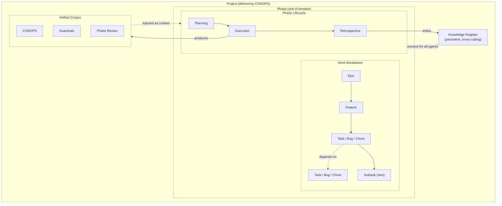

# POE — Pairti Orchestration Engine: Architecture

**Status**: Draft
**Last updated**: 2026-03-07

---

## Overview



---

## Design Drivers

1. **Each phase is a PDCA cycle.** Plan (increment planning) → Do (autonomous execution) → Check (retrospective, validity) → Act (replan, update skills and knowledge). The cycle repeats. Without the Act step, the loop doesn't close and the agent team doesn't improve. The human dial sits on top of the cycle — each quadrant can be autonomous, collaborative, or human-led depending on project maturity.

   > **Design note**: The PDCA frame arrived late in the design session as an intuition, not as a starting point. It immediately validated the existing stage structure and became the primary conceptual anchor for the whole phase model. It is listed first here because it should be the first thing an implementer understands — but it was the last thing discovered. Stay open to these late-arriving frames; they often carry the most clarity.
   ```
   Plan  →  define T, assemble K, choose S
   Do    →  f(C, T, S, K, H) → C'
   Check →  compare C' against C!
   Act   →  tighten T, S, K to close the gap
   ```
2. **Plan broadly, implement narrowly, replan aggressively.** The CONOPS and Phase plan define the shape. Execution is focused and bounded. The Retrospective updates the plan before the next Phase begins.
3. **Local-first.** All project state lives in `{project}/.poe/` — portable, no central store.
4. **Event-driven.** No polling. Agents emit structured events; the backend ingests them into SQLite and pushes deltas to the frontend via Tauri events.
5. **Agents run autonomously.** Human oversight is observational by default, not supervisory. The human invests effort before execution (planning, guardrails) so that execution can succeed without intervention.
6. **The knowledge register is institutional memory.** It accumulates across phases and is always current. Agents read it before acting; they write to it when they learn something worth preserving.

---

## The Unit of Work

The orchestrator's fundamental job is to assemble and dispatch units of work. Understanding what a unit of work *is* defines both what the orchestrator schedules and what the Retrospective corrects.

> **Design note**: This model was not designed top-down. It emerged during the design session when asking what the agent's CRUD protocol was actually operating on. The question "what is the orchestrator scheduling?" revealed the unit of work as the fundamental abstraction, and the imperfect-inputs framing followed naturally. This is the kind of insight that arrives late and clarifies everything — worth preserving as a reminder to hold design sessions open rather than closing on structure too early.

A unit of work is a function over imperfect inputs:

```
f(C, T, S, K, H) → C'

Ideal: f(C, T!, S!, K!, H!) → C!
```

| Input | What it is | How it can be imperfect |
|---|---|---|
| **C** | The codebase as it stands | Accumulated drift from prior imperfect outputs |
| **T** | The task — scope and description of the activity | Ambiguous, incomplete, or misjudged scope |
| **S** | The skill — how the specialist should approach the work | Wrong role, poorly defined behaviour, missing domain knowledge |
| **K** | The total project knowledge available at execution time | Gaps, outdated entries, missing context not yet discovered |
| **H** | Human input — guidance, decisions, corrections during execution | Contradictory, misremembered, or evolving — humans can misguide as well as guide |

The gap between C' (what was produced) and C! (what was intended) is the accumulated error from all five imperfect inputs. Each bad output is a diagnostic: which input was furthest from ideal?

### Implications for the Orchestrator

The orchestrator does not merely schedule tasks — it assembles the best possible input bundle `(C, T, S, K, H)` for each unit of work given what is currently available. The quality of that assembly determines output quality. This is why:

- **Artifacts flow forward as context** — they are the best current approximation of C for the next task
- **The knowledge register is injected at task start** — it closes gaps in K
- **Skills are loaded from the priority chain** — project-local overrides make S closer to S!
- **Planning is front-loaded** — the investment in T before execution reduces the cost of bad H mid-run

### Implications for the Retrospective

The Retrospective is fault attribution. Given C' ≠ C!, which input was responsible?

- T was poorly scoped → refine the task decomposition process
- S was wrong for this domain → update the skill file
- K had a gap → add a knowledge register entry
- H was contradictory → note the decision and its rationale

The Retrospective's outputs — updated skills, new knowledge entries, refined planning guidance — are systematic corrections that move each input closer to its ideal for the next phase. This is the feedback loop that makes the agent team better over time.

### The Two Sides of the Same Coin

The orchestrator (which assembles inputs and schedules work) and the orchestrated (the agent that executes) are two sides of the same coin. The orchestrator creates the conditions for success; the agent operates within them. When an agent underperforms, the question is rarely "was the agent bad?" — it is "which input was furthest from ideal, and whose responsibility was it to provide that input?"

---

## Work Breakdown Structure

The WBS is the vertical decomposition axis. Every node in the hierarchy knows its parent, giving agents (and humans) the full "why" chain at any level of zoom.

```
Project
  Phase
    Epic
      Feature
        Task | Bug | Chore
          Subtask             (rare — only for genuinely complex tasks)
```

### Definitions

**Project** — the top-level container. Defined by the CONOPS. A project has one artifact corpus, one knowledge register, and a sequence of phases.

**Phase** — a meaningful increment toward the CONOPS. The unit of iteration. Each phase gets a full lifecycle pass (Planning → Execution → Retrospective). Phases are planned at a high level upfront and refined as the project matures.

**Epic** — a major body of work within a phase. Groups related features that together deliver a significant capability. An epic is too large to execute directly; it exists to provide grouping and context.

**Feature** — a discrete, deliverable unit of functionality within an epic. A feature should be completable within a phase. It has a clear definition of done.

**Task / Bug / Chore** — the agent-executable leaf node.
- **Task**: new work that produces something
- **Bug**: a defect to be corrected
- **Chore**: maintenance, refactoring, or housekeeping that has no direct user-facing output

**Subtask** — a subdivision of a task used only when a task is genuinely too complex to assign to a single agent invocation. Subtasks are the exception, not the rule.

---

## Dependency Model

Dependencies are horizontal linkages between tasks (and optionally features) within a phase. They express execution ordering: *you cannot do A before B*.

- Dependencies are set during Phase Planning by the planning specialist.
- The execution engine resolves the DAG: tasks with no unmet dependencies are immediately eligible to run; dependent tasks wait.
- Independent tasks run in parallel.
- A dependency can exist between tasks within the same feature, across features within an epic, or across epics within a phase.
- Cross-phase dependencies are expressed at the Phase level in the project plan, not at the task level.

---

## Artifact Corpus

Artifacts are the structured documents that define the product. They are phase outputs — produced by a lifecycle stage and injected as context into subsequent stages.

### Artifact Flow

Artifacts flow forward through the lifecycle. Each stage receives all artifacts produced by prior stages as context. A stage cannot read future artifacts. There is no hardcoded ordering — context resolution matches artifacts by type and phase.

### Standard Artifacts

| Artifact | Produced by | Scope |
|---|---|---|
| `conops.md` | CONOPS stage | Project |
| `architecture-constraints.md` | Guardrails stage | Project |
| `design-system.md` | Guardrails stage | Project |
| `user-analysis.md` | Guardrails stage | Project |
| `must-nots.md` | Guardrails stage | Project |
| `guardrails-review.md` | Guardrails stage (EM review) | Project |
| `phase-N-plan.md` | Planning stage | Phase |
| `phase-N-review.md` | Execution stage (PM review) | Phase |
| `phase-N-validity.md` | Retrospective stage | Phase |
| `phase-N-rca.md` | Retrospective stage | Phase |

### Storage

Artifact content lives in `{project}/docs/`. The project database tracks metadata: artifact type, producing stage, phase number, and timestamp. The database is the index; the filesystem holds the content.

---

## Knowledge Register

The knowledge register is the project's institutional memory. It is distinct from the artifact corpus:

| | Artifact Corpus | Knowledge Register |
|---|---|---|
| **Purpose** | Defines the product | Guides execution |
| **Lifecycle** | Phase outputs; superseded by later versions | Persistent; accumulates across all phases |
| **Writable by** | Agents (via `poe:artifact`) | Agents and humans |
| **Examples** | CONOPS, architecture doc, phase review | Architectural decisions, domain glossary, failed approaches, discovered constraints, integration notes |

### What belongs in the Knowledge Register

- Architectural decisions and their rationale ("we chose X over Y because Z")
- Domain terminology and glossary
- Things tried that did not work, and why
- Constraints discovered during execution (not known at planning time)
- Integration notes and gotchas
- Project-local agent skill overrides (written by the Retrospective stage)

### Structure

The knowledge register is a set of named entries, each with a key, a value, and a timestamp. Entries can be updated or superseded but are never deleted (history is preserved). Agents query the register by key or by full-text search before acting on tasks that may be affected.

### Storage

Knowledge register entries live in the project database alongside the WBS graph. They are surfaced in the UI as a browsable, searchable panel.

---

## Data Model

All project state is local-first, stored in `{project}/.poe/dag.db` (SQLite, WAL mode).

### Core Tables

```
projects          — project metadata, CONOPS reference, active phase
phases            — phase definitions, status, lifecycle stage
nodes             — WBS nodes (Project / Phase / Epic / Feature / Task / Bug / Chore / Subtask)
                    type, title, description, status, skill_id, assignee, phase_id, parent_id
edges             — directed dependency edges between nodes (from_id, to_id, type)
artifacts         — artifact index (type, filename, phase_number, produced_by_stage, created_at)
knowledge         — knowledge register entries (key, value, source, created_at, supersedes_id)
events            — structured agent event log (agent_id, event_type, payload, created_at)
agents            — active and historical agent records (id, skill_id, task_id, status, started_at)
queue_items       — human decision queue (question, options, agent_id, task_id, resolved_at)
```

### Key Relationships

- Every WBS node has a `parent_id` (enabling full hierarchy traversal) and a `phase_id`.
- Edges are typed: `depends_on` (execution ordering) or `relates_to` (informational).
- Events reference the agent and the task they were emitted from.
- Queue items reference the agent and task that raised the question.

---

## Agent Event Protocol

Agents communicate with POE via structured JSON lines written to stdout, prefixed `poe:`. This is the sole structured communication channel — not PTY scraping.

| Event | Purpose |
|---|---|
| `poe:brief` | Agent's interpretation of its task, written before execution begins. Drives the glass-box interpretation view. |
| `poe:step` | Named progress milestone during execution. |
| `poe:artifact` | Produce a named artifact. Written to `docs/`, indexed in the database. |
| `poe:task` | Create a WBS node (used by planning specialist to populate the task graph). |
| `poe:edge` | Create a dependency edge between two nodes. |
| `poe:knowledge` | Write an entry to the knowledge register. |
| `poe:decision` | Raise a question for the human decision queue. Includes options if the agent has identified them. |
| `poe:review` | Request a peer review from another specialist agent. Blocks the requesting agent until the reviewer completes. |
| `poe:done` | Signal task completion. |

PTY output remains available as a drill-down for any specific agent but is not the primary signal. The structured event stream is what drives the UI.

### Agent-to-Agent Review Cycle

Agents can request peer review from other specialist agents without human facilitation. This eliminates the need for a human to act as message relay between agents — the orchestrator routes the conversation.

**The pattern:**

```
Agent A (e.g. Architect) emits poe:review
  → Orchestrator creates a review task, assigns it to the named skill (e.g. tauri-engineer)
  → Agent A status = blocked (waiting for review)
  → Agent B (Tauri Engineer) receives full context: Agent A's brief + artifacts + the review question
  → Agent B produces a review artifact (poe:artifact) and signals poe:done
  → Orchestrator unblocks Agent A, injects Agent B's review into Agent A's context
  → Agent A continues with the reviewer's assessment in hand
```

**poe:review payload:**

```json
{
  "event": "poe:review",
  "skill": "tauri-engineer",
  "question": "Are these 4 features ready for implementation? Flag any gaps.",
  "context": "optional additional framing"
}
```

The human observes the entire exchange via the activity feed. Queue items only arrive if both agents hit genuine ambiguity neither can resolve — which is the correct escalation point.

**What this replaces:** the human reading one agent's output, copying it to another agent's terminal, reading the response, and copying it back. The orchestrator does this. The human watches.

### poe:brief

The `poe:brief` event is emitted by every agent at the start of execution, before any work begins. It externalises the agent's interpretation of its task so the human can verify intent asynchronously. The agent proceeds immediately after emitting the brief — it does not wait for human acknowledgement.

```json
{
  "event": "poe:brief",
  "task_id": "task-abc",
  "interpretation": "I understand this task as: ...",
  "plan": "I will: 1. ... 2. ... 3. ...",
  "assumptions": ["...", "..."]
}
```

---

## Human Oversight

### Activity Feed (Glass Box)

The activity feed shows, across all active agents and projects:

- The agent's `poe:brief` — what it understood the task to be and its plan
- `poe:step` milestones as they are emitted
- Task completion status
- Any questions raised to the human queue

The feed is built entirely from the structured event log. It is not derived from PTY output.

### Decision Queue

Agents that encounter genuine ambiguity emit a `poe:decision` event with a question and optionally a set of candidate options. This creates a queue item. The human resolves it; the agent is unblocked. Unrelated agents continue running in parallel.

A low queue volume is a quality signal: it means the planning and guardrails stages produced sufficient context. A high volume indicates the preconditions were insufficient.

### Queue Advisor (AI Decision Aid)

The decision queue is not a simple approval interface — it is a collaborative decision-making space. Each queue item has a chatbot advisor associated with it. When the human is uncertain how to resolve a question, they can instruct the advisor to help: *"Go check what the architecture constraints say about this"*, *"Has this come up before?"*, or *"Spawn a quick research task on X."*

The advisor is well-positioned to help because it has direct access to the inputs that should inform the decision:

- **K** — the knowledge register, searchable for prior decisions and discovered constraints
- **Artifacts** — the full project artifact corpus (CONOPS, guardrails, phase plans)
- **DAG context** — the blocked task, its dependencies, its parent feature and epic

The advisor researches; the human decides. The boundary is explicit: the advisor does not resolve queue items — it improves the quality of human input (H) before the human commits.

> **Design note**: The Queue Advisor's location evolved during design. The initial question was whether the *orchestrator* needed AI support for scheduling decisions. The answer was no — orchestration is deterministic given a well-formed DAG. The real judgment gap is in the human's decisions, not the engine's. Placing the advisor at the queue level rather than the task level keeps AI support where it actually reduces friction.

In terms of the formal model, the Queue Advisor is an **H-quality tool** — it exists to make human decisions better-informed before they enter the execution loop.

#### Evolution Path

```
Phase 1: Queue → Human decides alone
Phase 2: Queue + Advisor → Human asks it to research, then decides
Phase 3: Advisor proactively surfaces relevant K before human has to ask
Phase 4: Advisor auto-resolves low-stakes decisions, escalates genuine ambiguity only
```

The system starts simple. AI support is added where friction is actually felt, not speculatively.

---

## Orchestration Engine

The orchestrator is a Rust service inside Tauri. It is not a sidecar, not an external workflow engine. It starts with the app, recovers from SQLite on restart, and reacts to DAG changes. SQLite is the sole source of durable state.

### What Triggers It

The orchestrator is reactive — it wakes on events, not on a timer:

- `poe:done` received — a task completed, dependents may now be ready
- `poe:task` / `poe:task:cancel` — DAG structure changed
- `poe:edge` / `poe:edge:remove` — dependency graph changed
- Human resolves a queue item — a blocked agent can continue
- Human advances a stage gate — next stage becomes active
- App start — recover and resume from prior state

### The Core Loop

Every wake-up runs the same loop regardless of trigger:

```
1. Find all tasks where:
   - status = pending
   - all dependency tasks = complete
   - stage is in execution mode (not held at a human gate)
   - concurrency limit not reached

2. For each ready task:
   a. Assemble input bundle (T, S, K — C is implicit, H arrives during execution)
   b. Spawn agent
   c. Mark task as running

3. Emit frontend deltas
```

### Two Levels of Orchestration

- **Stage gates** — human-driven. The orchestrator holds until the human explicitly advances. No tasks start in the next stage until the gate is cleared. The human controls the stages.
- **Task scheduling** — dependency-driven. Within an active stage, the orchestrator runs everything the DAG says is ready, automatically. The DAG controls the tasks.

### Input Bundle Assembly

Before spawning an agent, the orchestrator assembles the context it needs:

| Input | Source |
|---|---|
| **C** (codebase) | Implicit — agent runs in the project directory |
| **T** (task) | Node record from SQLite — title, description, type, plus full WBS ancestry (task → feature → epic → phase) |
| **S** (skill) | Loaded from skill file priority chain (bundle → user → project-local) |
| **K** (knowledge) | Artifacts declared as inputs for this stage type (selective, not full corpus) + all knowledge register entries |
| **H** (human input) | Not assembled upfront — arrives during execution via `write_to_agent` if needed |

**WBS ancestry** is always injected. Knowing that a task belongs to feature X, epic Y, phase Z gives the agent the "why" chain that informs every decision it makes.

**K selectivity**: the stage type declares what artifact types it consumes. The orchestrator filters the artifact corpus to those types only. Knowledge register entries are always injected in full — they are designed to be concise and universally relevant.

### Event Ingester

The event ingester is the bridge between agent stdout and the DAG. It runs as part of the agent watchdog, processing every line of output:

```
Line received from agent PTY
  → not prefixed poe:  → pass to PTY buffer (raw view only)
  → prefixed poe:      → parse JSON → write to SQLite → trigger orchestrator → emit Tauri event
```

| Event | SQLite write | Triggers orchestrator |
|---|---|---|
| `poe:brief` | Insert into events log | No |
| `poe:step` | Insert into events log | No |
| `poe:task` | Insert node | Yes |
| `poe:task:update` | Update node | Yes |
| `poe:task:cancel` | Set status = cancelled | Yes |
| `poe:edge` | Insert edge | Yes |
| `poe:edge:remove` | Delete edge | Yes |
| `poe:artifact` | Insert/update artifact record + write to `docs/` | No |
| `poe:knowledge` | Insert knowledge entry | No |
| `poe:decision` | Insert queue item | No |
| `poe:done` | Set status = complete | Yes |

The orchestrator is notified via a Tokio `mpsc` channel (`DagChanged` signal). Anything that mutates DAG structure or task status triggers it; everything else records and notifies the frontend only.

### Recovery

On app restart:

```
1. Open all known project databases
2. Find tasks with status = running → agent process is gone
3. Attempt to resume each interrupted agent using its stored session ID (Claude --resume)
4. If resume fails → mark task back to pending, orchestrator re-spawns fresh
5. Queue items persist as-is
6. Artifacts persist on disk and in SQLite index
7. Trigger orchestrator loop → re-evaluates all ready tasks
```

Agent session IDs are stored in the agents table at spawn time specifically to enable resume. Resume is attempted first; clean restart is the fallback.

### Concurrency

Two levels of concurrency limit, both configurable and visible in the UI:

| Limit | Default | Description |
|---|---|---|
| Per-project | 5 | Max concurrent agents within a single project |
| Global | 15 | Max concurrent agents across all open projects |

The orchestrator respects both limits when selecting tasks to spawn in the core loop. If the limit is reached, ready tasks are queued in the DAG (status remains pending) until a running agent completes.

The UI displays a concurrency indicator — running count / limit — for each project and globally. Both limits are adjustable from the UI. Higher limits suit powerful machines with fast API access; lower limits suit constrained environments or when the human wants to keep queue volume manageable.

---

## Agent Tooling (MCP)

The `poe:` event protocol is one-way — agent writes, POE ingests. MCP (Model Context Protocol) makes the interface bidirectional, adding the Read side to the CRUD model and exposing project-specific tooling to agents.

### Complementary Roles

| Protocol | Direction | Purpose |
|---|---|---|
| `poe:` events | Agent → POE | Writes — DAG mutations, artifacts, progress, decisions |
| MCP tools | Agent ↔ POE | Reads + structured operations — queries, tooling, project utilities |

### Why This Matters

The input bundle assembled at task start is a snapshot. As execution progresses an agent may need information that wasn't knowable at start — especially in a living DAG where other agents are writing concurrently. MCP gives agents a structured way to query mid-task without relying on what was injected into the prompt upfront.

### Planned MCP Tool Categories

**DAG & Knowledge Queries**
- Query current task status and dependency state
- Search the knowledge register by keyword or topic
- Retrieve specific artifacts by name or type

**Project Tooling**
- Run the test suite and return structured results
- Check git status, diff, and recent history
- Execute project-specific build or validation commands

**Write Operations** (structured alternative to `poe:` events for complex mutations)
- Create or update WBS nodes with validation
- Resolve ambiguities against the knowledge register before raising a `poe:decision`

### Status

MCP tooling is a planned capability. The `poe:` event protocol is sufficient for the initial implementation. MCP is introduced once the core orchestration loop is stable, prioritising the tools that most reduce `poe:decision` queue volume.

---

## Skill System

Skills are the specialist definitions that agents execute under. Each skill is a markdown file with YAML frontmatter defining the role, behaviour, and expected outputs.

### Load Order (highest priority wins)

1. App bundle defaults (`resources/skills/`)
2. User-level overrides (`~/.poe/skills/<skill-id>.md`)
3. Project-level overrides (`{project}/.poe/skills/<skill-id>.md`)

### Skill Evolution

After each phase, the Retrospective stage may update project-local skill files to capture lessons learned. The human can promote project-local improvements to the user level if they apply broadly. Skills improve across phases; the agent team becomes better at working on this specific project over time.

---

## Process Architecture

```
Tauri App (Rust + React)
  ├── SQLite (dag.db)          — WBS graph, artifacts index, knowledge register, event log
  ├── AgentState               — active PTY processes, watchdog
  ├── ProjectState             — open projects, active project
  ├── FileWatcher              — watches {project}/.poe/events/ for agent event files
  ├── EventIngester            — parses poe: events, writes to SQLite, emits Tauri events
  └── Frontend (React)
        ├── ActivityFeed       — live agent event stream
        ├── DecisionQueue      — human decision queue
        ├── WBSView            — project / phase / epic / feature / task hierarchy
        ├── ArtifactsView      — artifact corpus browser
        └── KnowledgeView      — knowledge register browser

Agent (Claude Code subprocess)
  — reads task brief + artifact context + knowledge register snapshot
  — emits poe: events to stdout
  — PTY available for raw inspection
```

---

## Invariants

1. **One project per directory.** Project state is co-located with the project. No central store.
2. **Artifacts flow forward only.** A stage can read artifacts from prior stages but not future ones.
3. **Knowledge register is append-only.** Entries can be superseded but never deleted.
4. **The event log is the audit trail.** Every agent action that matters is recorded as a structured event.
5. **Human gates are explicit.** No phase advances without a human decision. The human can choose to skip a gate, but the skip is recorded.
6. **The queue should be sparse.** Frequent agent questions indicate insufficient preconditions, not a healthy workflow.
