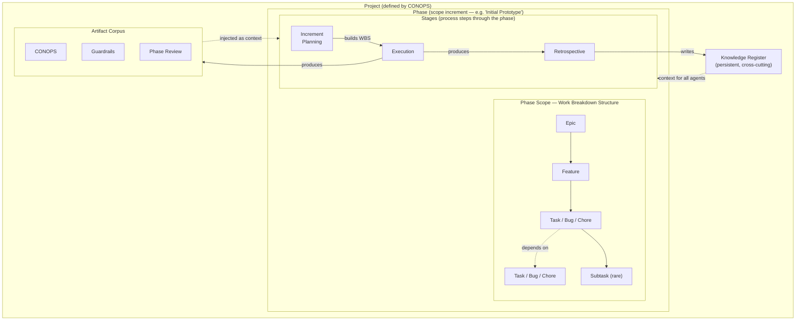

# POE — Pairti Orchestration Engine: Architect

**Status**: Draft
**Last updated**: 2026-03-15 (rev 2026-03-15: DAG Service replaces poe:task/poe:edge; reviewers read DAG directly; MCP elevated to primary write mechanism; Phase/Stage model — phases are scope iterations, stages are process steps within a phase)

---

## Overview



---

## Design Drivers

1. **Each phase runs two nested PDCA loops.** The outer loop checks and corrects what was built; the inner loop checks and corrects how it was planned and executed. Both loops must close. A system with only an outer loop learns slowly and wastes effort on rework that better planning would have prevented. A system with only an inner loop improves execution efficiency but never asks whether it is building the right thing.

   ### The Inner Loop — Plan Quality (pre-execution)

   Closes *before execution begins*. Checks and corrects the plan: whether work is well-decomposed, dependencies are correct, tasks are right-sized, and the right specialists are assigned. A plan that survives this loop produces much better execution output — because T is closer to T!.

   ```
   Plan  →  Increment Planning: decompose into epics, features, tasks; define T; assign skills S
   Check →  Plan Review: specialists (architect, engineer, PM) review the plan via poe:review;
             flag gaps, ambiguities, wrong skill assignments, missing dependencies
   Act   →  Plan Revision: planning specialist updates the DAG based on findings; may iterate
   Do    →  Execution begins on the approved plan
   ```

   The inner loop closes the gap in **T** (task quality) before it can corrupt output. Human input (**H**) is invested here — in the plan review, not in mid-execution firefighting. A busy decision queue during execution is usually a signal that the inner loop was skipped or was insufficient.

   **The loop may iterate.** A single review pass is the common case, but a plan with significant issues may require multiple cycles: Review → Revise → Review again. This is expected and correct — iteration is cheaper pre-execution than post. The planning specialist tracks unresolved findings and drives subsequent iterations autonomously via `poe:review`.

   **Escalation to human.** If the loop cannot converge — reviewers keep finding blockers, or reviewers disagree on a fundamental design question — the planning specialist escalates via `poe:decision`. The human takes the call, breaks the deadlock, and the loop resumes. This is the correct escalation point: a human decision that is structural, not incidental. The queue should be sparse; if plan reviews frequently escalate, it is a signal that the CONOPS or Guardrails stage produced insufficient clarity.

   ### The Outer Loop — Deliverable and Process Quality (post-execution)

   Closes after execution. Checks and corrects what was built and how the agent team performed.

   ```
   Do    →  Execution: f(C, T, S, K, H) → C'  (inner loop already closed; T is solid)
   Check →  Validity Analysis: does C' satisfy C!? where is the gap between built and intended?
   Act   →  Retrospective: RCA on quality gaps → update S (skills), update K (knowledge register),
             tighten guardrails if needed; feed improvements into the next phase
   ```

   The outer Act corrects **S** (skill quality) and **K** (knowledge gaps). It does not re-execute tasks — that is Rework's territory when specific deliverable deficiencies are found. It prepares the agent team to perform better in the *next* phase.

   ### Why Both Loops Are Necessary

   | | Inner Loop | Outer Loop |
   |---|---|---|
   | **When** | Pre-execution — plan is checked before Do begins | Post-execution — output is checked after Do completes |
   | **Checks** | Plan quality — is the work correctly decomposed? | Deliverable quality — was the right thing built? |
   | **Acts on** | Task structure, dependencies, skill assignments | Skills, knowledge register, guardrails |
   | **Corrects** | **T** (task quality) + **H** (human investment upfront) | **S** (skills) + **K** (knowledge) |
   | **Stage types** | `plan_review` → `plan_revision` → `execution` | `validity_analysis` → `retrospective` |
   | **Failure signal** | Busy decision queue during execution | Gap between C' and C! at validity check |

   A defect that the inner loop catches is a planning failure. A defect that only the outer loop catches is a skill or knowledge failure. This distinction drives where the correction goes — and makes the Retrospective's output (updated skills and knowledge) meaningful rather than generic "lessons learned."

2. **Plan broadly, implement narrowly, replan aggressively.** The CONOPS and Phase plan define the shape. Execution is focused and bounded. The Retrospective updates the plan before the next Phase begins.
3. **Local-first.** All project state lives in `{project}/.poe/` — portable, no central store.
4. **Implementation directory is `poe2/`**. `poe/` is the v1 app (Restate-based, retired). All POE v2 code — Rust backend, React frontend, skills — lives in `poe2/`. Do not modify `poe/`.
4. **Event-driven.** No polling. Agents read and write project state via the DAG Service (MCP tools); the DAG Service notifies the orchestrator directly after each commit. Agents emit control-flow events via the `poe:` protocol; the backend ingests these to drive the activity feed and decision queue, and pushes deltas to the frontend via Tauri events.
6. **Agents run autonomously.** Human oversight is observational by default, not supervisory. The human invests effort before execution (planning, guardrails) so that execution can succeed without intervention.
7. **The knowledge register is institutional memory.** It accumulates across phases and is always current. Agents read it before acting; they write to it when they learn something worth preserving.

---

## The Unit of Work

The orchestrator's fundamental job is to assemble and dispatch units of work. Understanding what a unit of work *is* defines both what the orchestrator schedules and what the Retrospective corrects.

A unit of work is a function over imperfect inputs:

```
f(C, T, S, K, H) → C'

Ideal: f(C, T!, S!, K!, H!) → C!
```

| Input | What it is | How it can be imperfect |
|---|---|---|
| **C** | The codebase as it stands | Accumulated drift from prior imperfect outputs |
| **T** | The task — scope and description of the activity | Ambiguous, incomplete, or misjudged scope |
| **S** | The skill — how the specialist should approach the work | Wrong role, poorly defined behaviour, missing domain knowledge |
| **K** | The total project knowledge available at execution time | Gaps, outdated entries, missing context not yet discovered |
| **H** | Human input — guidance, decisions, corrections during execution | Contradictory, misremembered, or evolving — humans can misguide as well as guide |

The gap between C' (what was produced) and C! (what was intended) is the accumulated error from all five imperfect inputs. Each bad output is a diagnostic: which input was furthest from ideal?

### Implications for the Orchestrator

The orchestrator does not merely schedule tasks — it assembles the best possible input bundle `(C, T, S, K, H)` for each unit of work given what is currently available. The quality of that assembly determines output quality. This is why:

- **Artifacts flow forward as context** — they are the best current approximation of C for the next task
- **The knowledge register is injected at task start** — it closes gaps in K
- **Skills are loaded from the priority chain** — project-local overrides make S closer to S!
- **Planning is front-loaded** — the investment in T before execution reduces the cost of bad H mid-run

### Implications for the Retrospective

The Retrospective is fault attribution. Given C' ≠ C!, which input was responsible?

- T was poorly scoped → refine the task decomposition process
- S was wrong for this domain → update the skill file
- K had a gap → add a knowledge register entry
- H was contradictory → note the decision and its rationale

The Retrospective's outputs — updated skills, new knowledge entries, refined planning guidance — are systematic corrections that move each input closer to its ideal for the next phase. This is the feedback loop that makes the agent team better over time.

### The Two Sides of the Same Coin

The orchestrator (which assembles inputs and schedules work) and the orchestrated (the agent that executes) are two sides of the same coin. The orchestrator creates the conditions for success; the agent operates within them. When an agent underperforms, the question is rarely "was the agent bad?" — it is "which input was furthest from ideal, and whose responsibility was it to provide that input?"

---

## Work Breakdown Structure

The WBS is the scope axis. It defines **what is being built**. Every node in the hierarchy knows its parent, giving agents (and humans) the full "why" chain at any level of zoom.

```
Project
  Phase                      ← scope increment ("Initial Prototype", "Feature A")
    Epic
      Feature
        Task | Bug | Chore
          Subtask             (rare — only for genuinely complex tasks)
```

Phases define the scope. Stages define the process for working through it. See §Stages below.

### Definitions

**Project** — the top-level container. Defined by the CONOPS. A project has one artifact corpus, one knowledge register, and a sequence of phases.

**Phase** — a meaningful scope increment toward the CONOPS. Examples: "Initial Prototype", "Feature A", "Performance Hardening". Each phase owns a WBS (its epics, features, and tasks) and is worked through a sequence of stages. Phases are defined upfront at a high level and refined as the project matures.

**Epic** — a major body of work within a phase. Groups related features that together deliver a significant capability. An epic is too large to execute directly; it exists to provide grouping and context.

**Feature** — a discrete, deliverable unit of functionality within an epic. A feature should be completable within a phase. It has a clear definition of done.

**Task / Bug / Chore** — the agent-executable leaf node.
- **Task**: new work that produces something
- **Bug**: a defect to be corrected
- **Chore**: maintenance, refactoring, or housekeeping that has no direct user-facing output

**Subtask** — a subdivision of a task used only when a task is genuinely too complex to assign to a single agent invocation. Subtasks are the exception, not the rule.

---

## Stages

Stages are the **process axis**. They define how a phase is worked through — not what is being built, but how the building happens. The WBS and the stages are orthogonal: the WBS defines scope, stages define workflow.

```
              | increment_planning | execution | retrospective |
Phase 1       | PM builds DAG      | Tasks run | RCA runs      |
Phase 2       | PM builds DAG      | Tasks run | RCA runs      |
```

### Stage Gate Model

Each stage transition is a gate. The human reviews what the stage produced and decides to advance, revise, or re-run. Stages within a phase do not auto-advance — the human holds the gate between them.

A phase is complete when all its stages are complete and the final gate is cleared.

### Stage Types

| Stage Type | PDCA | Purpose |
|---|---|---|
| `conops` | — | Define the product concept, users, and operational context |
| `guardrails` | — | Define architecture, interfaces, data model, design system, must-nots |
| `increment_planning` | Plan | Decompose the phase scope into epics, features, and tasks via the DAG Service |
| `plan_review` | Check | Specialists review the WBS from the DAG before execution begins |
| `execution` | Do | Dispatch and run the approved task set |
| `rework` | Act (targeted) | Address specific deficiencies found in validity analysis |
| `validity_analysis` | Check | Validate what was built against the CONOPS |
| `retrospective` | Act (systemic) | RCA on quality gaps; update skills and knowledge register |
| `onboarding` | — | Orient a new agent team to an existing project |

The `increment_planning` stage is the only stage that mutates the phase WBS. All other stages read the WBS (via DAG Service read tools) or operate on artifacts. The `execution` stage dispatches whatever tasks the planning stage created.

### Stage Types and the Data Model

Stages are stored in the `stages` table (see Protocol.md §1). Each stage row belongs to a phase and has a `stage_type`, an ordering `number` within the phase, and a `status`. The `nodes` table's `phase_id` references the **phase** (iteration), not the stage — tasks belong to the phase regardless of which stage created or executes them.

---

## Dependency Model

Dependencies are horizontal linkages between tasks (and optionally features) within a phase. They express execution ordering: *you cannot do A before B*.

- Dependencies are set during Phase Planning by the planning specialist.
- The execution engine resolves the DAG: tasks with no unmet dependencies are immediately eligible to run; dependent tasks wait.
- Independent tasks run in parallel.
- A dependency can exist between tasks within the same feature, across features within an epic, or across epics within a phase.
- Cross-phase dependencies are expressed at the Phase level in the project plan, not at the task level.

---

## Artifact Corpus

Artifacts are the structured documents that define the product. They are phase outputs — produced by a lifecycle stage and injected as context into subsequent stages.

### Artifact Flow

Artifacts flow forward through the lifecycle. Each stage receives all artifacts produced by prior stages as context. A stage cannot read future artifacts. There is no hardcoded ordering — context resolution matches artifacts by type and phase.

### Standard Artifacts

**Project-level** — produced once, injected into every subsequent stage's input bundle:

| Artifact | Produced by | Purpose |
|---|---|---|
| `conops.md` | CONOPS stage | Product concept, users, goals, operational context |
| `architecture-constraints.md` | Guardrails stage | Architecture decisions, patterns, must-use technologies |
| `interface-control.md` | Guardrails stage | External interface definitions — wire protocols, event formats, API contracts, inter-subsystem boundaries |
| `data-model.md` | Guardrails stage | Internal data structures — DB schema, type definitions, entity relationships |
| `design-system.md` | Guardrails stage | UI design tokens, component patterns, visual language |
| `user-analysis.md` | Guardrails stage | Personas, user journeys, feature priority matrix |
| `must-nots.md` | Guardrails stage | Hard constraints — security, compliance, things the system must never do |
| `guardrails-review.md` | Guardrails stage (Senior Engineer review) | Cross-cutting review of all guardrails artifacts for conflicts and gaps |
| `flows.md` | Guardrails stage (interface-analyst) | Runtime execution flows — orchestrator behaviour, agent lifecycle, yield/resume paths, and human interaction patterns |

**Phase-level** — produced per phase:

| Artifact | Produced by | Purpose |
|---|---|---|
| `phase-N-plan.md` | Increment Planning stage | Epic/feature/task decomposition for this phase |
| `phase-N-plan-review.md` | Plan Review stage (inner loop Check) | Specialist findings on the plan before execution |
| `phase-N-data-model-delta.md` | Increment Planning stage (if schema changes) | Additions to the data model for this phase |
| `phase-N-validity.md` | Validity Analysis stage | Gap between C' and C! for this phase |
| `phase-N-rca.md` | Retrospective stage | Root cause analysis and corrective actions |

> **Note**: `interface-control.md`, `data-model.md`, and `flows.md` close the gap that existed in POE v1 — implementation agents had no authoritative spec for internal structure, interface contracts, or runtime behaviour injected into their context, leading to protocol conflicts and orchestration bugs discovered only during coding. These documents are injected into every implementation task's input bundle via the standard K assembly.

### Storage

Artifact files live in `{project}/docs/`. The project database tracks metadata only: artifact type, filename, producing stage, phase number, and timestamp. **The database is the index; the filesystem holds the content.**

Agents write artifact files directly using their own tools (e.g. Claude's Write / Edit / Bash). The orchestrator never writes artifact content — it only records the path when `poe:artifact` arrives. This keeps the orchestrator thin and lets agents like Claude Code use their native file capabilities without the orchestrator reimplementing them.

**Input bundle assembly**: the orchestrator injects artifact paths into the T+S+K bundle as a list of filenames. Downstream agents read the files themselves. Content is never embedded in the bundle. See Protocol.md §3.

---

## Knowledge Register

The knowledge register is the project's institutional memory. It is distinct from the artifact corpus:

| | Artifact Corpus | Knowledge Register |
|---|---|---|
| **Purpose** | Defines the product | Guides execution |
| **Lifecycle** | Phase outputs; superseded by later versions | Persistent; accumulates across all phases |
| **Writable by** | Agents (write file directly, declare via `poe:artifact`) | Agents and humans |
| **Examples** | CONOPS, architecture doc, phase review | Architectural decisions, domain glossary, failed approaches, discovered constraints, integration notes |

### What belongs in the Knowledge Register

- Architectural decisions and their rationale ("we chose X over Y because Z")
- Domain terminology and glossary
- Things tried that did not work, and why
- Constraints discovered during execution (not known at planning time)
- Integration notes and gotchas
- Project-local agent skill overrides (written by agents via `poe:skill` during execution or the Retrospective stage)

### Structure

The knowledge register is a set of named entries, each with a key, a value, and a timestamp. Entries can be updated or superseded but are never deleted (history is preserved). Agents query the register by key or by full-text search before acting on tasks that may be affected.

### Storage

Knowledge register entries live in the project database alongside the WBS graph. They are surfaced in the UI as a browsable, searchable panel.

---

## Data Model

All project state is local-first, stored in `{project}/.poe/dag.db` (SQLite, WAL mode).

See `doc-POE/Protocol.md §1` for the complete CREATE TABLE schema. Key tables:

- `phases` — scope iterations ("Initial Prototype", "Feature A"); each belongs to a project
- `stages` — process steps within a phase (`increment_planning`, `execution`, `retrospective`, etc.); each belongs to a phase
- `nodes` — WBS nodes (title, description, type, skill, status, parent\_id, phase\_id, session\_id, verdict); `phase_id` references `phases.id` (the iteration, not the stage)
- `edges` — directed dependency edges (from\_id, to\_id)
- `events` — append-only structured agent event log (never updated or deleted)
- `queue_items` — human decision queue items (question, options, resolution)
- `artifacts` — artifact index (name, type, path, producing\_task\_id)
- `knowledge` — knowledge register entries (key, value, supersedes\_id)
- `projects` — project metadata; tracks `active_phase_id` and `active_stage_id`

Every `nodes` row has a `parent_id` (full WBS hierarchy traversal) and a `phase_id` pointing to the phase iteration. Tasks belong to the phase regardless of which stage created or dispatches them. Queue items reference the task that raised the question. The events table is the audit trail — every poe: event lands here in full.

**Agent stream transcripts** are written outside the DB, to `{project}/.poe/agent_stream/{agent_id}.jsonl` — one file per agent session, one raw stream-json line per entry. These are durable transcripts for post-session inspection and are not read by the orchestrator at runtime.

---

## Agent Event Protocol

Agents communicate with POE via structured JSON events embedded in the `--output-format stream-json` transport — not PTY scraping. The orchestrator spawns agents with `claude --output-format stream-json -p --dangerously-skip-permissions [--model <id>]`, writes the T+S+K bundle to stdin, and reads newline-delimited JSON from stdout. The `--model` flag is included when the skill's frontmatter declares a `model:` field; otherwise the claude binary uses its configured default. poe: events are extracted from assistant text content via a line-accumulation buffer. See `doc-POE/Protocol.md §2` and `§5` for the full wire format and spawn model.

| Event | Purpose |
|---|---|
| `poe:brief` | Agent's interpretation of its task, written before execution begins. Drives the glass-box interpretation view. |
| `poe:step` | Named progress milestone during execution. |
| `poe:artifact` | Declare a file the agent has already written to `docs/` using its own tools. Orchestrator indexes the path; downstream agents read the file directly. No content is embedded in the event. |
| `poe:knowledge` | Write an entry to the knowledge register. |
| `poe:skill` | Write a reusable pattern to `{project}/.poe/skills/<name>.md`. Closes the self-improvement loop: any agent that discovers a project-specific pattern can persist it as a local skill override without manual authoring. |
| `poe:decision` | Raise a question for the human decision queue. Agent emits `poe:yield` immediately after; orchestrator resumes via `--resume` with the human's resolution. |
| `poe:review` | Request a peer review from another specialist agent. The `content` field is a review *directive* — task IDs and focus area, not a plan transcription. The reviewer reads the live WBS directly from the DAG via DAG Service tools. Agent emits `poe:yield` after all review requests; orchestrator spawns reviewer(s), then resumes requesting agent via `--resume` with results. |
| `poe:review-outcome` | Emitted by reviewer agents BEFORE `poe:done` to record their explicit verdict. Stored on `nodes.verdict`. Orchestrator reads `nodes.verdict` when building the ReviewResult bundle. Missing `poe:review-outcome` defaults to BLOCKED with a `poe-ingester-warning` to the frontend. |
| `poe:yield` | Yield control while awaiting an asynchronous response (review or decision). task status → waiting. See Flows.md §SF-3. |
| `poe:done` | Signal task completion. Task status → done. |

Human access to the raw agent conversation is via **xterm.js session handover** — `claude --resume <session_id>` in a PTY, bridged to the browser via WebSocket. ANSI codes are rendered by xterm.js natively; no parsing occurs on this path. The structured event stream drives the UI; the xterm handover is a drill-down for human-in-the-loop interaction.

### Agent-to-Agent Review Cycle

Agents can request peer review from other specialist agents without human facilitation. This eliminates the need for a human to act as message relay between agents — the orchestrator routes the conversation.

See `doc-POE/Flows.md §3.1` for the complete runtime sequence — reviewer dispatch, parallel multi-reviewer handling, result delivery via `--resume`, and key invariants.

**poe:review payload:**

```json
{"poe": "review", "reviewer_skill": "architecture-analyst", "id": "r-arch", "content": "Review tasks ep-01, ft-01..ft-05, t-01..t-15 in the current phase WBS. Focus: IIFE encapsulation pattern (t-05), animation guard lifecycle (t-13). Read tasks from the DAG using get_phase_wbs."}
```

See `doc-POE/Protocol.md §2` for the full wire format for all events.

The human observes the entire exchange via the activity feed. Queue items only arrive if both agents hit genuine ambiguity neither can resolve — which is the correct escalation point.

**What this replaces:** the human reading one agent's output, copying it to another agent's terminal, reading the response, and copying it back. The orchestrator does this. The human watches.

### poe:brief

The `poe:brief` event is emitted by every agent at the start of execution, before any work begins. It externalises the agent's interpretation of its task so the human can verify intent asynchronously. The agent proceeds immediately after emitting the brief — it does not wait for human acknowledgement.

```json
{"poe": "brief", "content": "I understand this task as: ... I will: 1. ... 2. ..."}
```

---

## Human Oversight

### Activity Feed (Glass Box)

The activity feed shows, across all active agents and projects:

- The agent's `poe:brief` — what it understood the task to be and its plan
- `poe:step` milestones as they are emitted
- Task completion status
- Any questions raised to the human queue

The feed is built entirely from the structured event log. It is not derived from PTY output.

### Decision Queue

Agents that encounter genuine ambiguity emit a `poe:decision` event with a question and optionally a set of candidate options. This creates a queue item. The human resolves it; the agent is unblocked. Unrelated agents continue running in parallel.

A low queue volume is a quality signal: it means the planning and guardrails stages produced sufficient context. A high volume indicates the preconditions were insufficient.

### Two Human Interaction Models

POE has two distinct models for human-agent interaction. They are not interchangeable and must not be conflated.

**Decision Arbitration** — the Decision Queue handles this. An autonomous agent is running and encounters something it cannot resolve from available context. It raises `poe:decision`, yields, and waits. The human makes a call; the agent continues. The human is an *arbitrator* — making a discrete choice to unblock a stalled process. The interaction is asynchronous, brief, and exception-driven. A healthy project has a sparse queue.

**Collaborative Artifact Building** — the Artifact Viewer handles this. A human and agent build a document together. The agent drives with `poe:chat` turns; the human shapes and refines through conversation. The evolving artifact is visible on the left; the conversation is on the right. The human is a *co-author* — participating in the creative process, not arbitrating an exception. The interaction is sustained, iterative, and goal-driven.

| | Decision Arbitration | Collaborative Artifact Building |
|---|---|---|
| **Agent mode** | Autonomous — hit a blocker | Interactive — co-authoring |
| **Human role** | Arbitrator | Co-author |
| **Protocol event** | `poe:decision` | `poe:chat` |
| **Yield reason** | `yield_reason='decision'` | `yield_reason='chat'` |
| **Surface** | Decision Queue (Pane 3) | Artifact Viewer — "Chat about this" activates chat panel |
| **Artifact visible** | No | Yes — live on the left |
| **Expected frequency** | Sparse — signals insufficient preconditions | Normal — the primary work mode for elicitation and planning stages |

An autonomous agent must never emit `poe:chat`. A collaborative agent uses `poe:chat` as its primary interaction mechanism; `poe:decision` remains available within a collaborative session for genuine structural calls that require explicit human arbitration.

### Queue Advisor (AI Decision Aid)

The decision queue is not a simple approval interface — it is a collaborative decision-making space. Each queue item has a chatbot advisor associated with it. When the human is uncertain how to resolve a question, they can instruct the advisor to help: *"Go check what the architecture constraints say about this"*, *"Has this come up before?"*, or *"Spawn a quick research task on X."*

The advisor is well-positioned to help because it has direct access to the inputs that should inform the decision:

- **K** — the knowledge register, searchable for prior decisions and discovered constraints
- **Artifacts** — the full project artifact corpus (CONOPS, guardrails, phase plans)
- **DAG context** — the blocked task, its dependencies, its parent feature and epic

The advisor researches; the human decides. The boundary is explicit: the advisor does not resolve queue items — it improves the quality of human input (H) before the human commits.

In terms of the formal model, the Queue Advisor is an **H-quality tool** — it exists to make human decisions better-informed before they enter the execution loop.

#### Evolution Path

```
Phase 1: Queue → Human decides alone
Phase 2: Queue + Advisor → Human asks it to research, then decides
Phase 3: Advisor proactively surfaces relevant K before human has to ask
Phase 4: Advisor auto-resolves low-stakes decisions, escalates genuine ambiguity only
```

The system starts simple. AI support is added where friction is actually felt, not speculatively.

---

## Orchestration Engine

The orchestrator is a Rust service inside Tauri. It is not a sidecar, not an external workflow engine. It starts with the app, recovers from SQLite on restart, and reacts to DAG changes. SQLite is the sole source of durable state.

### What Triggers It

The orchestrator is reactive — it wakes on events, not on a timer. **One controlled exception**: when dispatching reviewer tasks (SF-3 review path), the orchestrator spawns a per-reviewer Tokio watchdog timer. On fire, the watchdog checks reviewer task status and re-queues or cancels as appropriate (see Flows.md §SF-3). This is the only timer in the system — it is scoped to reviewer tasks and does not affect the core scheduling loop.

- `poe:done` received — a task completed, dependents may now be ready
- `poe:yield` received — a task yielded; orchestrator dispatches reviewers (reason=review) or waits for human (reason=decision)
- DAG Service write — an agent created, updated, or cancelled a node or edge via MCP tool call; the DAG Service notifies the orchestrator directly after committing to SQLite
- Human resolves a queue item — a blocked agent can continue
- Human advances a stage gate — next stage becomes active
- App start — recover and resume from prior state

### The Core Loop

Every wake-up runs the same loop regardless of trigger:

```
1. Find all tasks where:
   - status = pending
   - all dependency tasks = complete
   - stage is in execution mode (not held at a human gate)
   - concurrency limit not reached

2. For each ready task:
   a. Assemble input bundle (T, S, K — C is implicit, H arrives during execution)
   b. Spawn agent
   c. Mark task as running

3. Emit frontend deltas
```

### Two Levels of Orchestration

- **Stage gates** — human-driven. The orchestrator holds until the human explicitly advances. No tasks start in the next stage until the gate is cleared. The human controls the stages.
- **Task scheduling** — dependency-driven. Within an active stage, the orchestrator runs everything the DAG says is ready, automatically. The DAG controls the tasks.

### Input Bundle Assembly

Before spawning an agent, the orchestrator assembles the context it needs:

| Input | Source |
|---|---|
| **C** (codebase) | Implicit — agent runs in the project directory |
| **T** (task) | Node record from SQLite — title, description, type, plus full WBS ancestry (task → feature → epic → phase) |
| **S** (skill) | Loaded from skill file priority chain (bundle → user → project-local) |
| **K** (knowledge) | Artifact paths declared as inputs for this stage type (injected as filenames to read, not inline content) + all knowledge register entries |
| **H** (human input) | Not assembled upfront — arrives during execution via `write_to_agent` if needed |

**WBS ancestry** is always injected. Knowing that a task belongs to feature X, epic Y, phase Z gives the agent the "why" chain that informs every decision it makes.

**K selectivity**: the stage type declares what artifact types it consumes. The orchestrator filters the artifact corpus to those types only. Knowledge register entries are always injected in full — they are designed to be concise and universally relevant.

### Event Ingester

The event ingester is the bridge between the agent's JSON stream and the DAG. It runs as part of the agent watchdog, processing the stream-json output:

```
JSON object received from agent stdout
  → type = "system", subtype = "init"  → extract and store session_id in nodes.session_id
  → type = "assistant" or "content_block_delta"
       → extract text → push to text_buf
       → for each complete line in text_buf:
           → no "poe" key  → discard (agent commentary)
           → "poe" key     → parse → write to SQLite → trigger orchestrator → emit Tauri event
  → type = "result"        → flush text_buf tail → agent session complete
```

The orchestrator is notified via a Tokio `mpsc` channel (`DagChanged` signal). Anything that mutates DAG structure or task status triggers it; everything else records and notifies the frontend only.

See `doc-POE/Protocol.md §2` for the full ingester responsibility table (SQLite writes, orchestrator triggers, and Tauri events emitted per event type).

### Recovery

On app restart:

```
1. Open all known project databases
2. Ghost-agent sweep: find agents rows WHERE status='running' AND id NOT IN AgentMap
   → Mark as failed; reset associated node to pending via atomic db_claim_node_retry
   (This runs before node-level sweep so db_count_running_agents is clean first)
3. Find nodes with status = running → agent process is gone (no ghost row survived step 2)
   → Reset to pending (status was set at SF-1 step 0, agent process died)
4. Find nodes with status = waiting → agent yielded before crash; agent has already exited
   → Read nodes.yield_reason (direct column read — no events join required)
   → reason = review:
       Query reviewer nodes (requesting_task_id = node.id)
       All done/cancelled → trigger SF-4 (resume with batched ReviewResult)
       Some still pending/running → re-dispatch missing reviewers via SF-1; restart watchdog timers
   → reason = decision:
       queue_items row persists. Leave waiting — queue panel shows it to the human.
5. queue_items, artifacts, and knowledge persist as-is
6. Trigger synthetic DagChanged → orchestrator loop re-evaluates all ready tasks
```

**Status transition timing**: `nodes.status` is set to `'running'` by the atomic claim at SF-1 step 0, *before* bundle assembly and spawn. A node stays `'running'` in the DB from claim time until the agent emits `poe:done` or `poe:yield`. On restart, any `'running'` node without a live agent process is reset to `'pending'` — the atomic claim at SF-1 step 0 will prevent double-dispatch if two wake-ups happen to find the same ready node simultaneously.

Agent session IDs are written when the init event arrives (`nodes.session_id`), overwriting the prior value on each SF-4 continuation.

**Concurrent recovery**: Recovery is not performed serially. Each project's recovery work is spawned as an independent `tokio::spawn` task — the orchestrator does not `await` one project's recovery before beginning the next. On completion, each recovery task re-signals the orchestrator with `DagChanged::DagStructureChanged` so that normal task scheduling resumes for that project. The main orchestrator loop is never blocked by recovery; all projects recover in parallel.

### Concurrency

Two levels of concurrency limit, both configurable and visible in the UI:

| Limit | Default | Description |
|---|---|---|
| Per-project | 5 | Max concurrent agents within a single project |
| Global | 15 | Max concurrent agents across all open projects |

The orchestrator respects both limits when selecting tasks to spawn in the core loop. If the limit is reached, ready tasks are queued in the DAG (status remains pending) until a running agent completes.

**`waiting` tasks do not count against the concurrency limit.** A task in `waiting` status has no live agent process — the process exited after emitting `poe:yield`. Counting waiting tasks would artificially suppress parallelism while reviewers run. Only `status = running` tasks consume a concurrency slot.

The UI displays a concurrency indicator — running count / limit — for each project and globally. Both limits are adjustable from the UI. Higher limits suit powerful machines with fast API access; lower limits suit constrained environments or when the human wants to keep queue volume manageable.

**`db_count_running_agents` is a pure SQL query** — it counts `agents` rows with `status='running'` without any cross-reference to live processes. Its accuracy depends on ghost-agent recovery keeping those rows clean:

- **At project-open**: `recover_interrupted` calls `sweep_ghost_agents` before scheduling begins. This queries all `status='running'` agent rows, cross-references them against the in-memory `AgentMap`, marks orphans as `failed`, and resets their nodes to `pending`.
- **Periodic (every 5 min)**: `spawn_ghost_agent_integrity_loop` repeats the same sweep across all open projects while the app is running. This handles the crash-during-session scenario where a live agent's process dies mid-session without cleaning up.

The two-layer approach (open-time + periodic) ensures that `db_count_running_agents` reflects the true number of running processes, not stale DB rows from previous crashes.

### SQLite Lock Ordering

All code that touches the SQLite connection must obey this ordering invariant to prevent the connection lock from being held across async Tauri event emission, which would stall other DB operations:

```
1. Acquire the SQLite connection lock
2. Perform all DB reads and writes inside the closure
3. Collect any Tauri events to emit into a local Vec (do not emit yet)
4. Release the SQLite connection lock (closure returns)
5. Emit the collected Tauri events outside the lock
```

The critical rule is that Tauri event emission must happen **after** the connection lock is released, never inside it. Holding the lock during async emission blocks other threads from accessing the database for the duration of the emit call, serialising what should be concurrent operations. Collect events into a `Vec` inside the closure; iterate and emit after the closure returns.

### Stage Bootstrap

When a stage is activated and has no tasks, the orchestrator auto-creates a default task using a static stage-type → skill mapping. For `execution` stages, no bootstrap occurs — the tasks are created by the product-manager during the preceding `increment_planning` stage and already exist in the phase WBS.

**Stage-type → bootstrap skill mapping:**

| Stage type | Skill | Default task title |
|---|---|---|
| `conops` | `operational-analyst` | "Develop CONOPS" |
| `guardrails` | `must-not-analyst` | "Develop Guardrails" |
| `increment_planning` | `product-manager` | "Plan Increment" |
| `plan_review` | `senior-engineer` | "Review Plan" |
| `execution` | — (no bootstrap) | Tasks created by product-manager via DAG Service MCP tools during the preceding `increment_planning` stage; they already exist in the phase WBS |
| `rework` | `product-manager` | "Plan Rework" |
| `validity_analysis` | `validity-analyst` | "Validate Deliverables" |
| `retrospective` | `rca-analyst` | "Run Retrospective" |
| `onboarding` | `operational-analyst` | "Onboard to Project" |

**Bootstrap is skipped** if the stage already has tasks (human-added or previously bootstrapped). The check runs before the `DagChanged` signal is sent, so the orchestrator always sees at least one ready task when a stage activates.

**Purpose**: ensures every bootstrappable stage has at least one task to dispatch immediately after activation, preventing the "zero ready tasks" stall where the orchestrator wakes but has nothing to schedule.

---

## Agent Tooling (MCP)

The DAG Service is an MCP server embedded in POE and injected into every agent's tool set via `--mcp-config` at spawn time. It is the primary interface for all project state reads and writes. The `poe:` protocol handles control flow and observability only; it does not carry data.

### Separation of Concerns

| Channel | Direction | Purpose |
|---|---|---|
| DAG Service (MCP) | Agent ↔ POE | All reads and writes — DAG mutations, knowledge, artifact registration, queries |
| `poe:` events | Agent → POE | Control flow and observability — progress, decisions, reviews, completion |

### Architecture

The DAG Service runs as a short-lived subprocess (`poe-dag-mcp`) spawned by Claude per agent invocation via the MCP stdio model. Each agent spawn causes Claude to fork a new `poe-dag-mcp` process using the `command` entry in `mcp-config.json`. Multiple concurrent agents therefore run multiple concurrent `poe-dag-mcp` instances, all sharing the same `dag.db` (safe under SQLite WAL mode) and all connecting to the same `dag.sock` for back-channel notification to the orchestrator.

```
Agent (claude --mcp-config .poe/mcp-config.json)
  └── MCP tool call (e.g. create_task)
        └── poe-dag-mcp subprocess (spawned by Claude, one per agent)
              ├── Commits to SQLite (dag.db, WAL mode — concurrent writes safe)
              ├── Notifies Orchestrator (dag.sock → DagChanged signal)
              └── Relays Tauri event to Frontend (via main process over dag.sock)
```

POE writes `mcp-config.json` and listens on `dag.sock` before any agent is dispatched. The `poe-dag-mcp` binary must be present in the app bundle resource directory. See Protocol.md §6 for the full config format and tool surface.

This eliminates the previous design problem where agents described DAG mutations in text (as `poe:step` detail or review content) rather than materialising them as protocol events. If the agent hasn't called `create_task`, there are no tasks — the reviewer calling `get_phase_wbs` will find nothing to review.

### DAG Service Tool Surface

**Task CRUD**

| Tool | Operation | Notes |
|---|---|---|
| `create_task(title, skill, type, parent_id, description)` | Create | Returns `task_id`. Type: `epic`, `feature`, `task`, `bug`, `chore`, `subtask` |
| `get_task(id)` | Read | Full node record including WBS ancestry |
| `get_phase_wbs(phase_id)` | Read | Full task graph for a phase — epics, features, tasks, edges |
| `query_tasks(filters)` | Read | Filter by phase, skill, status, type, parent |
| `update_task(id, fields)` | Update | Refine scope, description, or skill assignment |
| `cancel_task(id, reason)` | Cancel | Marks as cancelled; preserved in history. Never hard-deleted. |

**Edge CRUD**

| Tool | Operation | Notes |
|---|---|---|
| `add_edge(from_id, to_id)` | Create | Finish-to-start dependency |
| `remove_edge(from_id, to_id)` | Delete | Remove dependency that no longer applies |

**Knowledge & Artifacts**

| Tool | Operation | Notes |
|---|---|---|
| `write_knowledge(key, value)` | Create / Supersede | Adds or supersedes a knowledge register entry |
| `query_knowledge(query)` | Read | Full-text search of the knowledge register |
| `register_artifact(name, type, path)` | Create | Declares an artifact file already written to `docs/` |
| `get_artifact(name)` | Read | Returns artifact metadata and path |

**Project Tooling**

| Tool | Operation | Notes |
|---|---|---|
| `run_tests()` | Execute | Runs the test suite; returns structured results |
| `git_status()` | Read | Current git status and recent history |

### Why MCP Over poe: Events for Writes

The previous design routed DAG writes through `poe:task` and `poe:edge` events in the agent's stdout stream. This created a failure mode: agents could describe intended mutations in `poe:step` detail fields or review content without emitting the actual protocol events — the plan existed only in narrative, not in the database. Reviewers had no way to verify the plan was real.

With the DAG Service, the write is the proof. A reviewer calling `get_phase_wbs` either receives the tasks or receives an empty graph — there is no middle ground where the plan exists as text but not as data.

---

## Skill System

Skills are the specialist definitions that agents execute under. Each skill is a markdown file with YAML frontmatter defining the role, behaviour, and expected outputs.

### Frontmatter Schema

Key fields parsed by the orchestrator at load time:

| Field | Required | Notes |
|---|---|---|
| `id` | Yes | Kebab-case; must match filename stem |
| `name` | Yes | Human-readable display name |
| `description` | Yes | One sentence — surfaced in UI and event trail |
| `modes` | Yes | `[autonomous]`, `[interactive]`, or both. Defaults to `[autonomous]` if absent |
| `model` | No | Claude model ID (e.g. `claude-opus-4-6`). When present, passed as `--model` to the claude spawn. When absent, claude uses its configured default |

Informational fields (`tags`, `applies_to`, `protocol_version`) are not parsed by the orchestrator.

### Load Order (highest priority wins)

1. App bundle defaults (`resources/skills/`)
2. User-level overrides (`~/.poe/skills/<skill-id>.md`)
3. Project-level overrides (`{project}/.poe/skills/<skill-id>.md`)

### Skill Evolution

After each phase, the Retrospective stage may update project-local skill files to capture lessons learned. The human can promote project-local improvements to the user level if they apply broadly. Skills improve across phases; the agent team becomes better at working on this specific project over time.

### Skills to Author

Missing specialists for the initial skill library:

| Skill | Stage | Role |
|---|---|---|
| `senior-engineer` | Guardrails (review), Plan Review (inner loop Check), ad-hoc via `poe:review` | Resolves protocol conflicts, reviews plans for technical correctness, answers implementation questions from other agents. Primary target for `poe:review` from implementation agents. |
| `interface-analyst` | Guardrails | Authors `interface-control.md` — defines wire formats, event protocols, API contracts, inter-subsystem boundaries |
| `data-model-analyst` | Guardrails | Authors `data-model.md` — defines DB schema, type definitions, entity relationships |
| `architecture-analyst` | Guardrails | Authors `architecture-constraints.md` |
| `must-not-analyst` | Guardrails | Authors `must-nots.md` |
| `validity-analyst` | Validity Analysis (outer loop Check) | Authors `phase-N-validity.md` |
| `rca-analyst` | Retrospective (outer loop Act) | Authors `phase-N-rca.md`, updates skills and knowledge register |

### Skill-Author: The Bootstrap Primitive

**What it is.** `skill-author.md` is the one bundled skill that is never auto-generated. It is the system's self-repair mechanism for a missing-skill failure. When the orchestrator cannot load a required skill at dispatch time, it instantiates a skill-author task, supplies the missing-skill context, and the skill-author agent produces a project-local skill file via `poe:skill`. Every other skill in the library can itself be authored or refined by running through the system; skill-author is the fixed point that makes this possible.

**The self-healing loop.** When `dispatch_task()` resolves the skill for a node and finds nothing loadable, instead of cancelling the task it performs the following sequence:

1. Creates a skill-author node (`phase_id = NULL`, `parent_id = NULL`). A null `phase_id` makes the node unconditionally eligible — it is not gated by any phase lifecycle and will be scheduled as soon as concurrency permits.
2. Wires a `depends_on` edge from every task blocked by the missing skill to the new skill-author node.
3. Sends `DagStructureChanged` to the orchestrator channel to wake the scheduler immediately.

When skill-author completes, it emits `poe:skill` → the orchestrator writes the file to `.poe/skills/{name}.md` → `NodeStatusChanged` fires → the run loop re-evaluates the dependency graph and dispatches the previously-blocked tasks, which now load the skill successfully.

**Dedup invariant.** Exactly one skill-author task may exist per missing skill name per project at any time. The node is identified by the title `"Synthesize missing skill: {skill_name}"`. If a skill-author task with that title already exists (status pending or running), `dispatch_task()` adds only the `depends_on` edge from the newly-blocked task to the existing skill-author node — it does not create a second node. This ensures that concurrent tasks blocked on the same missing skill converge on a single synthesis effort rather than spawning duplicate work.

**Priority chain interaction.** `poe:skill` always writes to the project-local tier (`.poe/skills/`). In the skill search path this is the highest-priority tier — it is evaluated after the user tier and before the bundle defaults. An authored skill therefore takes precedence over any bundled default with the same `id`, allowing the project to accumulate specialised behaviour that overrides general-purpose defaults without modifying the bundle.

**Effect on f(C, T, S, K, H).** The S-gap — a missing skill — is now self-closing within a single run. The system's skill vocabulary grows at runtime as it encounters work requiring skills it does not yet have. No manual skill authoring is required to unblock execution. From the perspective of the formal model, the Retrospective's corrective action on **S** can now happen automatically mid-phase, not only between phases — making skill quality a converging property of a run rather than a static precondition for one.

---

## Process Architecture

```
Tauri App (Rust + React)
  ├── SQLite (dag.db)          — WBS graph, artifacts index, knowledge register, event log
  ├── DAGService (MCP server)  — exposes full CRUD tool surface to agents; notifies Orchestrator on write
  ├── Orchestrator             — reactive scheduler; wakes on DagChanged from DAGService or poe: events
  ├── AgentState               — active agent processes (stream-json), watchdog, stdout readers
  ├── ProjectState             — open projects, active project
  ├── EventIngester            — reads stream-json stdout, extracts poe: control-flow events, writes to SQLite, emits Tauri events
  └── Frontend (React)
        ├── ActivityFeed       — live agent event stream
        ├── DecisionQueue      — human decision queue
        ├── WBSView            — project / phase / epic / feature / task hierarchy
        ├── ArtifactsView      — artifact corpus browser
        ├── KnowledgeView      — knowledge register browser
        └── AgentHandover      — xterm.js PTY panel (--resume, human-in-the-loop)

Autonomous Agent (claude --output-format stream-json -p --mcp-config poe-dag-service)
  — reads stdin bundle (T + S + K — see Protocol.md §3)
  — calls DAG Service MCP tools to read and write project state
  — emits poe: control-flow events embedded in assistant text ({"poe": "<type>", ...})
  — process exits after {"type":"result",...}
  — session_id stored at spawn from {"type":"system","subtype":"init",...}
  — terminated via nix::sys::signal::kill(pid, Signal::SIGTERM) when interrupted
    (uses nix crate directly — no kill subprocess spawned)
    SIGTERM gives the agent opportunity to clean up before exiting

Interactive Agent (claude --resume <session_id>, PTY)
  — human handover only — not parsed by orchestrator
  — raw bytes → WebSocket → xterm.js in browser
  — used for check-in, decision-assist, direct exploration
  — cwd MUST match the project.path used for the original stream-json session
    (Claude scopes sessions by directory — mismatch → "No conversation found")
```

---

## Event Ingester → Tauri Event Map

The `EventIngester` (`src-tauri/src/event_ingester/mod.rs`) processes each `poe:` event from the agent's stdout, writes to SQLite, and emits one or more Tauri events to the frontend. The canonical table is in `Protocol.md §4`; the entries below document the events that drive the Activity Feed panel.

| `poe:` event | DB write | Tauri event(s) emitted | Notes |
|---|---|---|---|
| `poe:brief` | `events` table | `poe-event` + `poe-agent-activity` (type: `'brief'`) | Agent's task interpretation — first entry in feed for a run |
| `poe:step` | `events` table | `poe-event` + `poe-agent-activity` (type: `'step'`) | Named progress milestone — primary liveness signal during long runs |
| `poe:artifact` | `artifacts` table | `poe-artifact-created` | Artifact produced |
| `poe:knowledge` | `knowledge` table | `poe-knowledge-created` | Knowledge register entry |
| `poe:done` | `nodes.status = complete` | `poe-task-done` | Task complete |
| agent spawn | — | `poe-agent-started` | Emitted by orchestrator, not ingester |
| agent exit | `agents.status` | `poe-agent-exited` | Emitted by orchestrator, not ingester |

### `poe-agent-activity` Payload

```typescript
interface PoeAgentActivity {
  taskId: string;   // task the agent is executing
  agentId: string;  // agent instance ID
  type: 'step' | 'brief';
  content: string;  // trimmed text content (poe:brief → "content" field; poe:step → "name" field)
}
```

Rust struct: `PoeAgentActivity` in `src-tauri/src/event_ingester/mod.rs`, annotated `#[serde(rename_all = "camelCase")]`.

---

## Orchestrator Concurrency Patterns

### DB-Arbitrated Single-Dispatch Claim

Any code path that wants to act on a node (resume it, retry it, close it) must first win an atomic `UPDATE ... WHERE ... AND status = '<expected>'`. The SQLite return value `rows_changed` is the arbiter:

- `rows_changed == 1` → this caller won; proceed with the action.
- `rows_changed == 0` → another path already moved the node out of the expected status; stand down silently.

This pattern eliminates duplicate dispatches that arise when two concurrent code paths (e.g., two reviewer completion callbacks, or an exit handler + a watchdog timer) both observe the same precondition and both attempt to act.

Two claims are used in the orchestrator:

| Function | SQL | Use case |
|---|---|---|
| `db_claim_node_resuming` | `UPDATE nodes SET status='resuming' WHERE id=? AND status='waiting'` | Resume race prevention |
| `db_claim_node_retry` | `UPDATE nodes SET status='pending', retry_count=retry_count+1 WHERE id=? AND status='running'` | Retry race prevention |

### `NodeStatus::Resuming`

`Resuming` is a transient lock status. When `check_review_completion` confirms all reviewers are done, it atomically claims the requesting task node via `db_claim_node_resuming` (`waiting → resuming`) before spawning the resume agent. Any concurrent caller that loses the claim sees `rows_changed == 0` and aborts.

On app restart, `recover_interrupted` resets all nodes in `resuming` status back to `waiting` (ghost-claim recovery). This handles the case where the app crashed after the claim was made but before `spawn_agent` completed. The node then re-enters the normal review-completion path on the next reviewer signal.

### Parent-ID Hierarchy Sweep

When any node reaches a terminal state (complete or cancelled), the orchestrator walks upward via `parent_id` to automatically close container nodes (feature, epic, project) whose children are all terminal. This is the primary close path for container nodes, which are never dispatched by `db_find_ready_tasks`.

Key design invariants:

- **Walk `parent_id` only** (organisational hierarchy). NEVER walk `edges` (technical dependencies). `parent_id` encodes "this node belongs to this container". `edges` encode "this node must complete before that node can start". These are intentionally separate axes.
- **`check_phase_completion` is called at each level** of the sweep — it is cheap and idempotent.
- **Empty containers do not auto-close** — `db_all_children_terminal` returns false when the parent has no children.
- The sweep is triggered in `handle_node_status_changed` in the `Complete | Cancelled` arm, after the existing review-completion and phase-completion checks.

---

## Invariants

1. **One project per directory.** Project state is co-located with the project. No central store.
2. **Artifacts flow forward only.** A stage can read artifacts from prior stages but not future ones.
3. **Knowledge register is append-only.** Entries can be superseded but never deleted.
4. **The event log is the audit trail.** Every agent action that matters is recorded as a structured event.
5. **Human gates are explicit.** No phase advances without a human decision. The human can choose to skip a gate, but the skip is recorded.
6. **The queue should be sparse.** Frequent agent questions indicate insufficient preconditions, not a healthy workflow.
7. **DB is the concurrency arbiter.** Any multi-path dispatch (resume, retry, container close) uses an atomic `UPDATE ... WHERE status=<expected>` claim. `rows_changed==0` means stand down.
