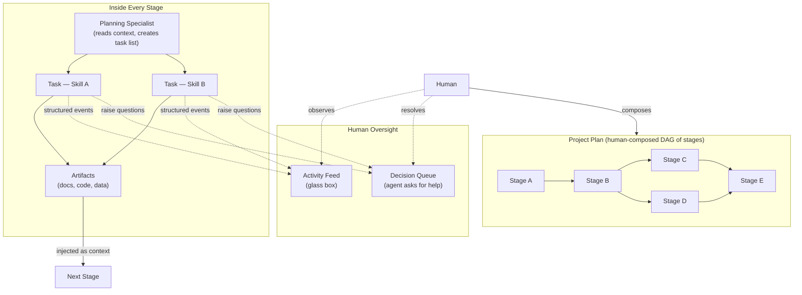

# POE — Pairti Orchestration Engine: Concept of Operations

**Status**: Draft
**Last updated**: 2026-03-07

> **Proof of concept**: The design session that produced this document and its companions (Architecture.md, UX-Brief.md) ran the exact lifecycle POE is designed to orchestrate — as a conversation. Concept → Guardrails → Architecture → UX Brief, collaboratively, with a human seeding the idea and an AI asking the questions. The output is the brief for the implementation. If POE can produce output of equal or better quality when it orchestrates this process through specialist agents, the concept is proven.

---

## Overview

---

## What is POE?

POE is a human-in-the-loop agentic coding and orchestration tool that provides full lifecycle oversight — from initial concept through to delivery.

The human's role changes across the lifecycle:

- **Before execution**: collaborative, high-bandwidth. The human seeds the idea, shapes the plan, defines constraints. This front-loading is the primary quality investment — clarity here directly determines how well agents execute later.
- **During execution**: low-bandwidth, observational. Agents run autonomously. The human can inspect activity at any time (glass box) and can pull the cord if something is going wrong. The human resolves agent questions when they arise, but this should be rare if the preconditions were good.
- **Between stages**: review and gate. The human reviews what was produced and decides whether to advance, revise, or re-run.

The goal is to make autonomous execution succeed by setting it up well, not to supervise it step-by-step.

---

## The Plan Model

A project plan is a **human-composed DAG of stage instances**. Stages can be arranged linearly (the common case) or in any valid dependency structure. The human controls the shape.

Key properties:

- **Non-linear by design.** The lifecycle is not a fixed pipeline. You can start at any stage, skip stages, repeat stages, or pick up a project mid-flight by inserting an onboarding stage at the front.
- **Stages as Lego bricks.** Each stage type has defined input connectors (what artifacts it needs) and output connectors (what artifacts it produces). Valid plans are those where dependencies are satisfiable.
- **One plan per project, iterating over time.** The plan grows as the project progresses. Completing a stage may inform the shape of the next.

---

## Core Primitives

### Stage

A stage is the atomic unit of a plan. It is self-contained: it knows what it needs, what it does, and what it produces. Stages compose multiple specialists working in sequence.

Every stage follows the same internal pattern:

1. **Planning specialist** reads the stage definition and all available input artifacts, then produces a task list with specialist assignments.
2. **Specialist agents** execute the tasks, possibly in parallel where dependencies allow.
3. **Artifacts** are produced as tasks complete.
4. **Human gate** (if the stage defines one): human reviews outputs and decides to advance, revise, or re-run.

A stage is complete when its declared output artifacts exist and any human gate has been resolved.

### Artifact

An artifact is a structured document produced by a stage — a CONOPS, an architecture doc, a design system, a task plan, a code module, a review report. Artifacts are the connectors between stages.

When a stage starts, context resolution automatically gathers all available artifacts that match the stage's declared inputs, regardless of which prior stage produced them. There is no hardcoded ordering — the artifact graph is the source of truth.

Artifacts live in the project directory (`docs/`, or alongside code) and are tracked in the project database with metadata (type, producing stage, timestamp).

### Task

A task is a discrete unit of work within a stage, assigned to a single specialist. Tasks are:

- **Small and focused** — a specialist should be able to execute a task without needing to resolve ambiguity.
- **Dependency-aware** — tasks within a stage can have dependencies; independent tasks run in parallel.
- **Artifact-producing** — every task has a declared output (a document, a code change, a review).

Tasks are created by the planning specialist at the start of each stage, not predefined. The plan knows what stages to run; the planning specialist decides how to decompose each stage into tasks given the current context.

### Skill

A skill is a specialist definition: the role the agent plays, how it behaves, what it emits, what it knows. Skills are markdown files with structured frontmatter, loaded from a priority chain:

1. App bundle defaults
2. `~/.poe/skills/<skill-id>.md` — user-level overrides
3. `<project>/.poe/skills/<skill-id>.md` — project-level overrides

Skills improve over time. After each stage, a review process can produce updated project-local skill files capturing lessons learned (e.g. "this project targets embedded devices — never propose cloud-native patterns"). The human can promote project-local improvements to the user level if they apply broadly.

---

## Human Oversight

### Glass Box

Agents run autonomously. The human is not blocking their progress. Instead, the human can look in at any time via a live activity feed that shows:

- What each active agent is currently doing
- The agent's interpretation of its task (written at task start, before execution begins)
- Structured progress events emitted by the agent as it works
- Which tasks are complete, in progress, or waiting

The activity feed is built on **structured events** emitted by agents, not raw terminal output. PTY output is available as a drill-down for any specific agent but is not the primary signal.

### Decision Queue

Agents can raise questions to the human queue: *"I've encountered an ambiguity — here are my three options, I need a call."* The human resolves the question; the agent unblocks. Unrelated agents continue running in parallel.

The queue should be sparse. A busy queue is a signal that the stage's preconditions were insufficient.

---

## Built-in Stage Types

The following stage types form the initial library. Most projects will use a subset in roughly this order, but there is no enforced sequence.

Each phase runs two nested PDCA loops. Stage types map to these loops as follows — see Architecture.md for the full model.

**Setup (establishes the outer loop baseline):**

| Stage Type | Purpose | Key Specialists | Primary Output |
|---|---|---|---|
| Project Onboarding | Join or resume a project; synthesise existing artifacts into a shared understanding | Operational Analyst | `onboarding-summary.md` |
| CONOPS | Define the product concept, users, goals, and operational context | Operational Analyst | `conops.md` |
| Guardrails | Define architecture, design system, user model, and must-nots | Architecture, Design, User, Must-Not Analysts + EM review | `architecture-constraints.md`, `design-system.md`, `user-analysis.md`, `must-nots.md`, `guardrails-review.md` |

**Inner loop — Plan quality (Plan → Do → Check → Act on the plan):**

| Stage Type | PDCA | Purpose | Key Specialists | Primary Output |
|---|---|---|---|---|
| Increment Planning | Plan | Select a meaningful next increment; decompose into epics, features, tasks | Product Manager | `phase-N-plan.md` |
| Execution | Do | Run a planned task set autonomously | Task specialists (per task type) | Code + artifacts |
| PM Review | Check | Assess whether the plan held: tasks right-sized, dependencies correct, scope delivered | Product Manager | `phase-N-review.md` |
| Rework | Act | Address plan deficiencies with a targeted task plan; re-execute affected tasks | Product Manager + task specialists | Updated artifacts (per task) |

**Outer loop — Deliverable and process quality (Check → Act on what was built and how):**

| Stage Type | PDCA | Purpose | Key Specialists | Primary Output |
|---|---|---|---|---|
| Validity Analysis | Check | Validate what was built against the CONOPS; identify the gap between C' and C! | Validity Analyst | `phase-N-validity.md` |
| Retrospective | Act | Root cause analysis on quality gaps; update skills, knowledge register, and guardrails | RCA Analyst | `phase-N-rca.md`, updated skills, updated knowledge |

---

## Agent Protocol

Agents communicate with POE via structured JSON events written to stdout — one event per line, each a JSON object with a `"poe"` key identifying the event type. This is the structured layer that drives the activity feed, artifact tracking, task management, and the decision queue. See `doc-POE/Protocol.md §2` for the full wire format.

The protocol is fundamentally **CRUD against the project database**. The DAG is not a static plan — it evolves as execution reveals new information, scope is refined, and dependencies are discovered or invalidated. Agents have full mutation rights over the graph.

### DAG Mutations

| Event | Operation | Purpose |
|---|---|---|
| `poe:task` | Create | Add a new node to the WBS (task, bug, chore, subtask) |
| `poe:task:update` | Update | Refine scope, description, or skill assignment on an existing node |
| `poe:task:cancel` | Cancel | Mark a node as no longer needed (preserved in history) |
| `poe:edge` | Create | Add a dependency between two nodes |
| `poe:edge:remove` | Remove | Remove a dependency that no longer applies |

### Artifacts & Knowledge

| Event | Operation | Purpose |
|---|---|---|
| `poe:artifact` | Create / Update | Produce or revise a named artifact (written to `docs/`, indexed in DB) |
| `poe:knowledge` | Create / Supersede | Write an entry to the knowledge register |

### Execution & Oversight

| Event | Purpose |
|---|---|
| `poe:brief` | Agent's interpretation of its task — written before execution begins, non-blocking |
| `poe:step` | Named progress milestone during execution |
| `poe:decision` | Raise a question for the human queue, with candidate options if available |
| `poe:done` | Signal task completion |

### The Living DAG

Dependencies and scope change as a project progresses. The planning specialist creates the initial DAG for a phase, but execution agents refine it as they encounter new information. The Retrospective stage is not a special process — it is the planning specialist running again with full mutation rights, pruning and extending the graph based on what was learned.

This is what "replan aggressively" means in practice: the DAG is always the current best understanding, not a frozen snapshot from planning time.

---

## Multi-Project Concurrency

POE manages multiple projects concurrently. Each project has its own plan, its own artifact corpus, and its own set of active agents. The human sees a unified view across all projects — a single activity feed and a single decision queue, scoped by project.

Project state is local-first: all state lives in `{project}/.poe/` — a SQLite database for the plan, task graph, and artifact index, plus the `docs/` directory for artifact content. No central store. Projects are portable.
