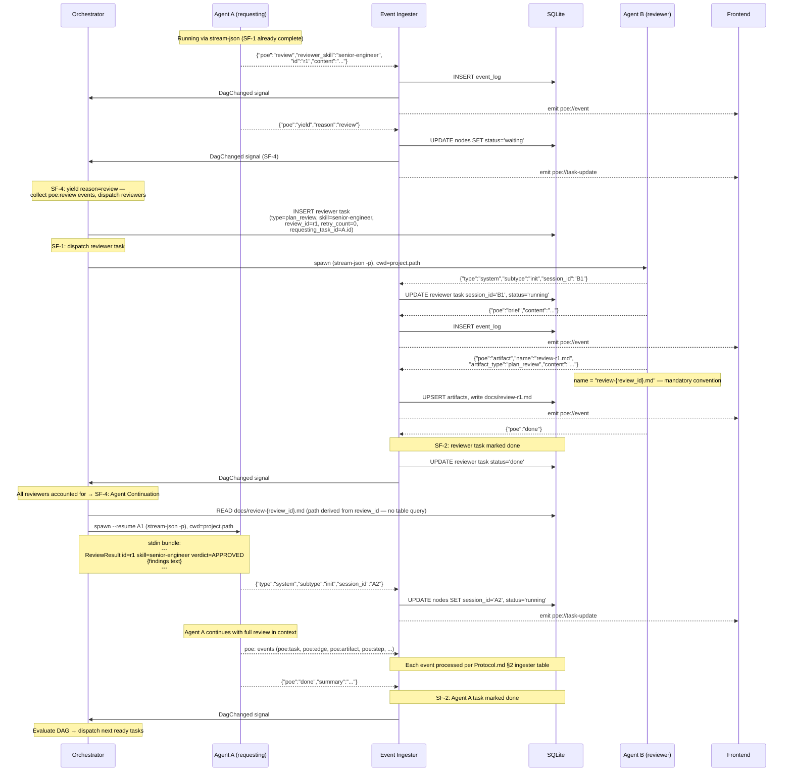
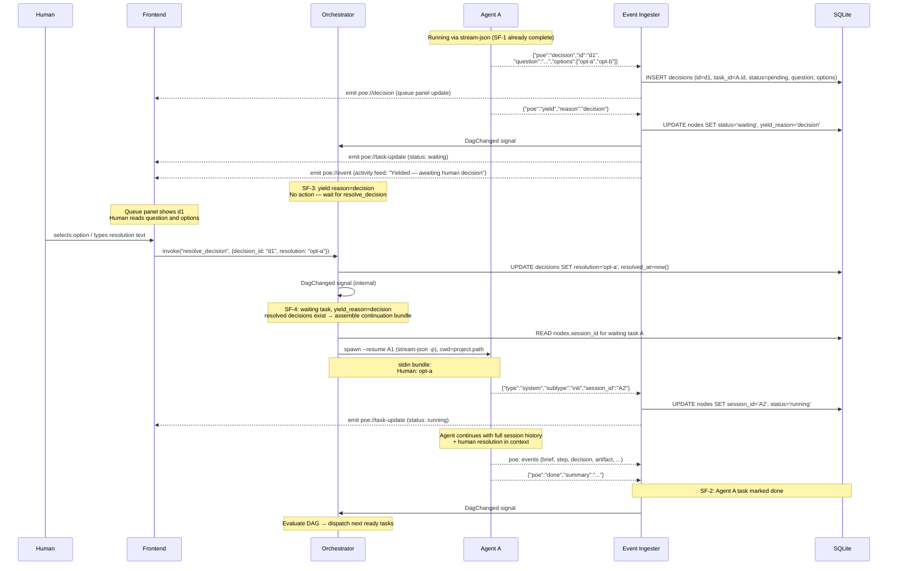
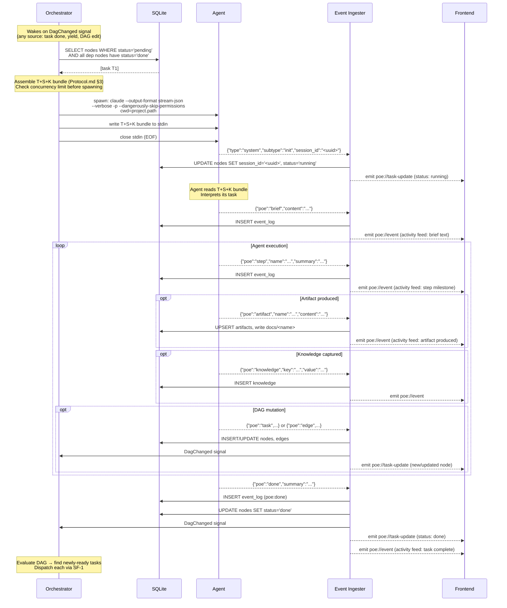
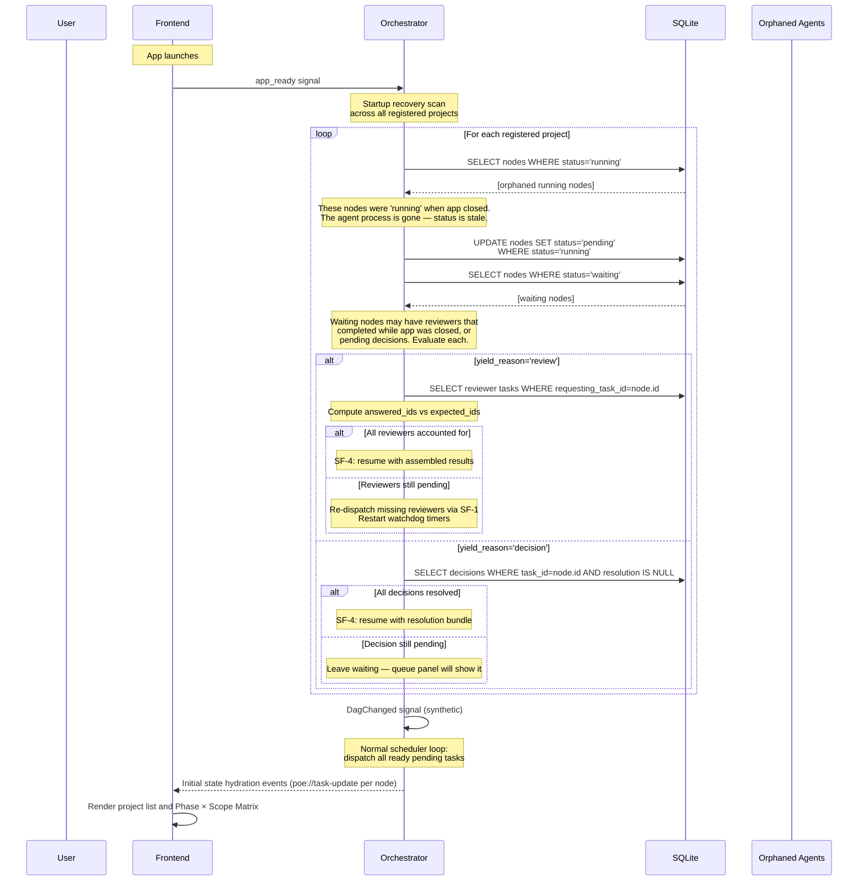
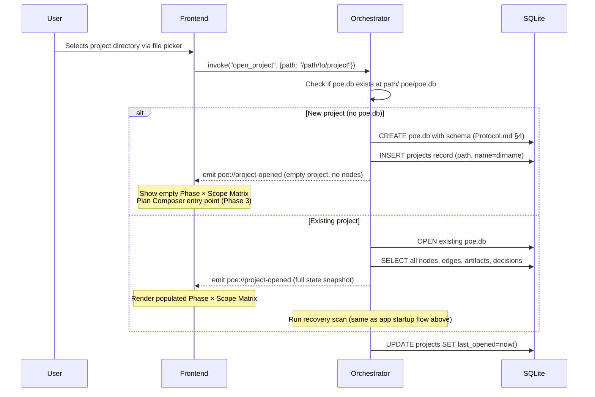
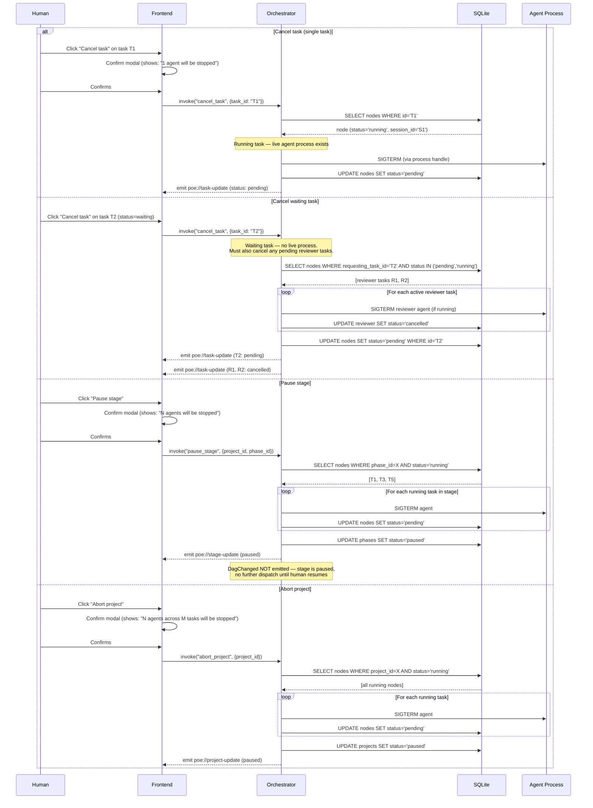
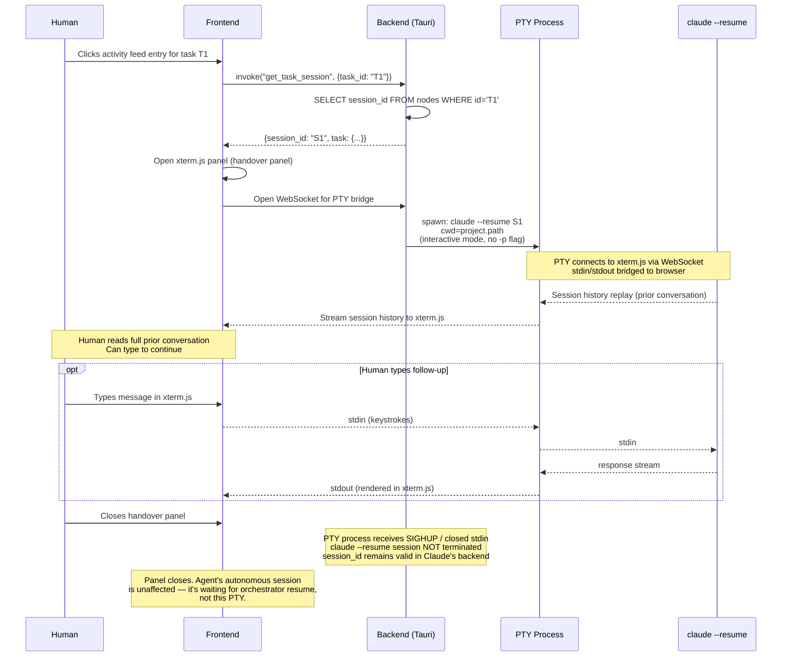
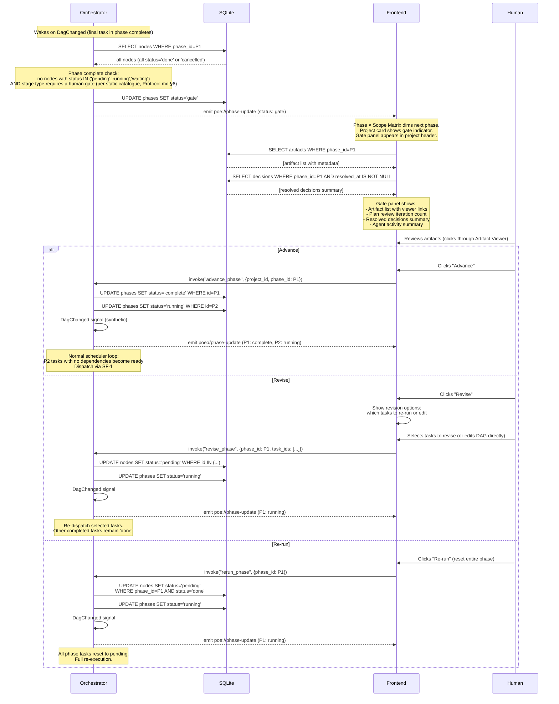
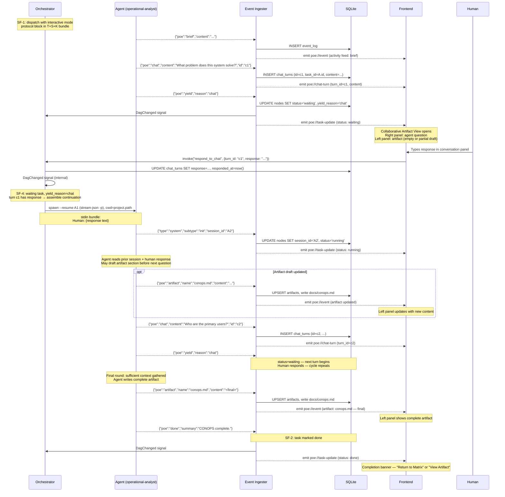

# POE — Runtime Flows

**Status**: Draft
**Last updated**: 2026-03-10

**Artifact classification**: `flows.md` — the authoritative Runtime Flows document for POE v2. Specifies the dynamic execution model: what happens in what order, who is responsible at each step, and the invariants that must hold across orchestrator, ingester, agent, and frontend. Injected into every implementation task's input bundle alongside `interface-control.md` and `data-model.md`.

> This document specifies the dynamic execution model for POE. It answers the question the other documents do not: *in what order do things happen, and who is responsible at each step?*
>
> Static definitions — wire format, schema, event catalogue, orchestrator structure — live in `Protocol.md` and `Architecture.md`. This document references them; it does not duplicate them.

---

## 1. Overview

The runtime is built from four cooperating components. Understanding their roles is the prerequisite for reading any flow.

| Actor | Role |
|---|---|
| **Orchestrator** | Reactive scheduler. Wakes on DAG-change signals. Finds ready tasks, assembles input bundles, spawns agents. See Architecture.md §Orchestration Engine. |
| **Event Ingester** | Bridge between agent stdout and the rest of the system. Reads stream-json output, extracts `poe:` events, writes to SQLite, signals the orchestrator, emits Tauri events to the frontend. See Protocol.md §5. |
| **SQLite** | Sole source of durable state. All orchestrator decisions are made by querying it. All agent outputs land here first. |
| **Frontend** | Receives Tauri events from the ingester. Never polls. Updates the activity feed, queue panel, and task matrix in response to events. |

Agents are not actors in the orchestration sense — they are processes spawned and monitored by the orchestrator. Their only output channel is stdout (stream-json); their only input channel is stdin (the T+S+K bundle at spawn, or a `--resume` continuation).

---

## 2. Sub-Flow Reference

These sub-flows appear inside multiple primary flows. They are defined once here and referenced by name.

### SF-1: Task Dispatch

*Trigger*: Orchestrator wakes (any `DagChanged` signal) and finds a task where `status = pending` and all dependency tasks have `status = done`.

```
1. Orchestrator assembles T+S+K bundle (Protocol.md §3)
2. Orchestrator spawns: claude --output-format stream-json --verbose -p
                               --dangerously-skip-permissions [--model <id>]
   cwd = project.path
3. Bundle written to stdin; stdin closed (EOF)
4. Ingester reads first stdout event:
     {"type":"system","subtype":"init","session_id":"<uuid>"}
   → UPDATE nodes SET session_id = '<uuid>', status = 'running'
5. Orchestrator emits poe://task-update to frontend
```

### SF-2: Agent Completion

*Trigger*: Ingester receives `{"poe":"done"}` in agent stdout.

```
1. Ingester: INSERT event_log (poe:done, full payload)
2. Ingester: UPDATE nodes SET status = 'done'
3. Ingester: signal Orchestrator (DagChanged)
4. Ingester: emit poe://task-update to frontend
5. Orchestrator wakes → evaluates DAG for newly-ready tasks → runs SF-1 for each
```

### SF-3: Yield Handling

*Trigger*: Ingester receives `{"poe":"yield", "reason":"..."}` in agent stdout.

The yield event is the handoff point — the agent process is about to exit and control passes to the orchestrator. The reason field determines what the orchestrator does next.

```
1. Ingester: INSERT event_log (poe:yield, full payload)
2. Ingester: UPDATE nodes SET status = 'waiting', yield_reason = payload.reason
3. Ingester: emit poe://task-update to frontend (status change)
4. Ingester: emit poe://event to frontend (activity feed entry: "Yielded — awaiting {reason}")
5. Ingester: signal Orchestrator (DagChanged)
6. Orchestrator wakes, reads nodes.yield_reason:

   reason = "review":
     → Collect all poe:review events logged for this task (these carry id, reviewer_skill)
     → expected_ids = {event.id for each poe:review event}  ← identity set, not a count
     → For each poe:review event:
         INSERT reviewer task (type=plan_review, skill=reviewer_skill,
                               requesting_task_id=task.id,
                               review_id=event.id,       ← links back to poe:review id
                               retry_count=0)
         Dispatch via SF-1
         Spawn per-reviewer Tokio watchdog timer (default: 5 min)
     → waiting task does NOT count against concurrency limit

   Completion check (fires on reviewer status=done via SF-2, OR on watchdog cancellation):
     → answered_ids = {nodes.review_id WHERE requesting_task_id=task.id
                                         AND status IN ('done', 'cancelled')}
     → If answered_ids = expected_ids → all reviews accounted for; trigger SF-4

   Watchdog timer fires for reviewer task R:
     → R.status = done → no action (already complete)
     → R.status ≠ done AND R.retry_count < max_retry (default 2):
         UPDATE nodes SET retry_count = retry_count + 1, status = pending
         Dispatch via SF-1 (re-spawn fresh)
         Spawn new watchdog timer
     → R.status ≠ done AND R.retry_count >= max_retry:
         UPDATE nodes SET status = cancelled
         Run completion check (above) — if answered_ids = expected_ids:
             Trigger SF-4 — include failed reviewer in bundle as:
             ReviewResult id={R.review_id} skill={skill} verdict=FAILED
             {Reviewer failed to respond after max retries. Escalate via poe:decision if required.}
         Else: await remaining reviewers (they may still complete)

   reason = "decision":
     → No immediate action — orchestrator waits for human resolution
     → Resolution arrives via invoke("resolve_decision") → triggers SF-4

   reason = "chat":
     → No immediate action — orchestrator waits for human response in Collaborative Artifact View
     → Response arrives via invoke("respond_to_chat") → triggers SF-4
     → Continuation bundle format is identical to decision: "Human: {response text}"
```

**Note**: `poe:decision` and `poe:chat` are both logged by the ingester before `poe:yield` arrives. The orchestrator reads `nodes.yield_reason` (not event_log) when it processes the yield — direct column read, no join required.

### SF-4: Agent Continuation (Resume)

*Trigger*: Orchestrator determines a `waiting` task can continue — all reviewers accounted for (SF-3 review path), human has resolved a decision (SF-3 decision path), or human has responded to a chat turn (SF-3 chat path).

Distinct from SF-1: the agent process has exited but the Claude session is still valid. A new process is spawned against the existing session via `--resume`. The stdin bundle is a continuation payload, not a full T+S+K.

```
1. Orchestrator reads nodes.session_id for the waiting task
2. Orchestrator assembles continuation bundle:
     - For poe:review completion: one ReviewResult block per reviewer (Protocol.md §5)
     - For poe:decision resolution: "Human: {resolution text}"
3. Orchestrator spawns:
     claude --output-format stream-json --verbose -p
            --dangerously-skip-permissions --resume <session_id>
   cwd = project.path  ← MUST match the original session cwd (Protocol.md §5)
4. Continuation bundle written to stdin; stdin closed (EOF)
5. Ingester reads first stdout event:
     {"type":"system","subtype":"init","session_id":"<new_uuid>"}
   → UPDATE nodes SET session_id = '<new_uuid>', status = 'running'
   (new session_id overwrites prior — old value is no longer valid)
6. Ingester: emit poe://task-update to frontend
7. Agent continues from full prior session history + new bundle content
```

**Failure mode**: If `--resume` fails (session expired or cwd mismatch), Claude returns an error before emitting the init event. The orchestrator detects absence of the init event within a timeout, marks the task back to `pending`, and falls back to SF-1 (fresh spawn with full T+S+K). The fresh spawn loses prior session context but the task restarts cleanly.

| | SF-1: Task Dispatch | SF-4: Agent Continuation |
|---|---|---|
| **Spawn flag** | none | `--resume <session_id>` |
| **stdin bundle** | Full T+S+K | Continuation payload only |
| **Status transition** | `pending → running` | `waiting → running` |
| **session_id** | First write | Overwrites prior value |
| **Failure fallback** | n/a | Falls back to SF-1 |

---

## 3. Primary Flows

### 3.1 Agent-to-Agent Review (`poe:review`)

**What it is**: A running agent requests specialist peer review of its work-in-progress — a plan, an artifact, a design decision. The orchestrator routes the review automatically. The requesting agent receives the result via `--resume` and continues. No human relay required.

**Canonical use case**: The product-manager agent has drafted the phase task DAG and wants a senior-engineer to validate it for technical correctness before emitting `poe:task` events to populate the WBS.

**Wire format reference**: Protocol.md §2 (`poe:review`, `poe:yield`, `poe:artifact`, `poe:done`). Reviewer stdin bundle: Protocol.md §3 "Reviewer stdin bundle".


#### Sequence Diagram



---

#### Walkthrough

**Phase 1 — Review request**

Agent A is running autonomously. At some point during execution it determines it needs specialist input before proceeding. It emits one `poe:review` event per reviewer required (see multi-reviewer variant below), then emits `poe:yield` with `reason: "review"`.

`poe:yield` hands control back to the orchestrator — *"I have emitted all my review requests and am now yielding. Resume me when results are available."* The ingester marks the task `waiting` and triggers SF-4.

The orchestrator is woken by the `DagChanged` signal on the `poe:yield` ingestion. It reads all `poe:review` events logged for this task since it last ran, and treats them as a batch.

**Phase 2 — Reviewer dispatch**

For each `poe:review` event, the orchestrator creates a reviewer task in SQLite:
- `type = plan_review`
- `skill` = the `reviewer_skill` field from the event
- `status = pending`
- `review_id` = the `id` field from the `poe:review` event — links reviewer task back to the specific review request for ID-based completion tracking
- `retry_count = 0`
- `requesting_task_id` = Agent A's task ID (back-reference for result routing and completion checks)

A per-reviewer Tokio watchdog timer is spawned at dispatch time (default: 5 min). See SF-4 for the full watchdog logic.

Reviewer tasks are **not WBS nodes** — they do not appear in the Phase × Scope Matrix. They appear in the activity feed because they emit `poe:` events, but they are system-generated supporting tasks.

The orchestrator immediately dispatches each reviewer via SF-1. For multiple reviewers, dispatch is parallel (subject to concurrency limits).

The reviewer's stdin bundle is a modified T+S+K where the Task section identifies this as a review task and includes the review request content (Protocol.md §3 "Reviewer stdin bundle"). The reviewer receives the same artifact corpus and knowledge register as the requesting agent.

**Phase 3 — Review execution**

The reviewer runs as a standard autonomous agent. It emits `poe:brief`, produces `poe:artifact` containing its findings, and emits `poe:done`. The review artifact is written to `docs/` and indexed in SQLite like any other artifact.

The reviewer does not emit `poe:task` or `poe:edge` events — it is not planning work, it is reviewing it.

**Phase 4 — Result delivery**

When all reviewer tasks are accounted for (`answered_ids = expected_ids`), the orchestrator reads each reviewer's artifact content from disk and formats it as a `ReviewResult` block (Protocol.md §5). It then resumes the requesting agent via **SF-4: Agent Continuation**, with a bundle containing all `ReviewResult` blocks in sequence.

The requesting agent resumes with its full prior session history plus the review results. It processes the findings and continues — creating tasks, revising its plan, or escalating if the review blocked.

**Phase 5 — Continuation**

Agent A completes its work and emits final `poe:done`. The ingester marks the task `done` and the orchestrator evaluates the DAG for newly-ready tasks.

---

#### Multi-Reviewer Variant

When Agent A emits multiple `poe:review` events before `poe:yield`, the orchestrator dispatches all reviewers in parallel. The requesting agent is resumed **once** when all reviewers are complete — not once per reviewer. The resume bundle contains all `ReviewResult` blocks in sequence:

```
---
ReviewResult id=r-eng skill=senior-engineer verdict=APPROVED
{findings}
---
ReviewResult id=r-arch skill=architecture-analyst verdict=APPROVED_WITH_CONDITIONS
{findings}
---
```

Agent A receives all results simultaneously and can reason across them before proceeding.

The orchestrator tracks completion by comparing two sets:
- **expected_ids**: review IDs from all `poe:review` events emitted before `poe:yield`
- **answered_ids**: `review_id` values from reviewer tasks with `requesting_task_id = A.id` and `status = done` or `status = cancelled` (cancelled = watchdog exhausted)

When `answered_ids = expected_ids`, all reviews are accounted for — the requesting agent is resumed via SF-3 with all results, including any `verdict=FAILED` entries for watchdog-exhausted reviewers.

---

#### Key Invariants

1. **poe:yield is unambiguous**: `poe:yield` always means waiting; `poe:done` always means complete. No conditional logic required in the ingester or orchestrator. The `reason` field (`"review"` | `"decision"`) tells the orchestrator which SF-4 path to take.

2. **Batch collection**: The orchestrator collects all `poe:review` events logged since the task last ran before dispatching reviewers. An agent that emits three `poe:review` events before `poe:yield` produces three reviewers, all dispatched in parallel.

3. **Single resume**: Regardless of how many reviewers ran, the requesting agent is resumed exactly once, with all results in a single bundle. Partial delivery is not permitted.

4. **Resume mechanics via SF-4**: Result delivery uses SF-4: Agent Continuation. cwd must match the original session's cwd; the new session_id overwrites the prior one immediately. If resume fails, SF-4 falls back to SF-1 (fresh spawn). See SF-4 for the full failure mode.

5. **Reviewer tasks are not WBS nodes**: Reviewer tasks are system-generated and are excluded from the Phase × Scope Matrix. They appear in the activity feed only.

6. **Reviewer artifact is stored and delivered**: The reviewer's `poe:artifact` is written to `docs/` and indexed in SQLite (permanent record). Its content is also extracted and inlined into the resume bundle (ephemeral delivery). Both happen; neither substitutes for the other.

---

### 3.2 Decision Escalation (`poe:decision`)

**What it is**: A running agent cannot proceed without a human call. It raises a decision to the queue, then yields. The orchestrator waits for the human to resolve via `invoke("resolve_decision")`. Resolution restarts the agent via SF-4: Agent Continuation.

**Canonical use case**: The CONOPS agent is conducting elicitation and has reached a question it cannot answer from available artifacts. It raises the question with candidate options, yields, and awaits human input before continuing.

**Wire format reference**: Protocol.md §2 (`poe:decision`, `poe:yield`), Protocol.md §5 ("Decision resolution via --resume").

> **Implementation note**: `resolve_decision` Tauri command currently writes directly to a process stdin. After the poe:yield refactor, there is no live process to write to — the agent has exited. `resolve_decision` must instead update the `decisions` table to `resolved` and signal the orchestrator (DagChanged), which then triggers SF-4. This is the primary regression introduced by the yield change.

#### Sequence Diagram



---

#### Walkthrough

**Phase 1 — Decision raised**

Agent A is running autonomously. It encounters an ambiguity or structural fork it cannot resolve from available context. It emits `poe:decision` — the event includes:
- `id`: decision identifier (unique within the task)
- `question`: the question text displayed to the human
- `options`: candidate options if enumerable (may be empty for open-ended questions)

The ingester writes the decision to the `decisions` table and emits `poe://decision` to update the queue panel immediately. The agent then emits `poe:yield reason=decision`.

**Note**: `poe:decision` is emitted *before* `poe:yield`. The ingester processes them as separate events in stream order. When the orchestrator wakes on the `DagChanged` from the yield, it reads `nodes.yield_reason` directly — no event log join required.

**Phase 2 — Orchestrator waits**

On `yield reason=decision`, the orchestrator takes no immediate action beyond confirming the waiting state. The task is removed from concurrency accounting (`waiting` tasks do not count against the concurrency limit). The orchestrator goes back to sleep.

**Phase 3 — Human resolution**

The queue panel displays the pending decision: question, options, task context, time waiting. For multi-round conversations (prior resolved decisions + one pending), the queue renders in conversation thread mode showing the full Q+A history (UX-Brief.md §Queue).

The human selects an option or types a free-text response. The frontend calls `invoke("resolve_decision", {decision_id, resolution})`. The orchestrator handler:
1. `UPDATE decisions SET resolution=<text>, resolved_at=now()`
2. Emits DagChanged internally

**Phase 4 — Continuation**

The orchestrator wakes, identifies the waiting task with `yield_reason='decision'` and checks whether all its decisions are resolved. With all decisions resolved, it triggers SF-4: Agent Continuation.

The continuation bundle format for a decision resolution is: `Human: {resolution text}` — a simple human-turn message, no structured block required. The agent receives its full prior session history plus this single new message, reads it as a human answer to its question, and continues.

**Phase 5 — Completion**

Agent A continues from the resolved decision point and eventually emits `poe:done`. SF-2 processes completion; the orchestrator evaluates newly-ready tasks.

---

#### Multi-Round Conversational Variant

The CONOPS elicitation agent conducts multiple sequential rounds. Each round:
1. Agent emits `poe:decision` (new id, question builds on prior answers)
2. Agent emits `poe:yield reason=decision`
3. Human resolves
4. Agent resumes via SF-4 with continuation bundle containing the resolution
5. Agent reads the answer, formulates next question, repeats

After the final round, the agent continues into substantive work (writing the CONOPS artifact) without yielding again.

The queue renders in thread mode when `decisions WHERE task_id = A.id AND status = 'resolved'` has rows AND one row has `status = 'pending'`. Thread mode shows the full Q+A pairs above the current question input.

Each round creates a new agent process (spawn → work → yield → terminate → spawn again). The session_id changes each round. This is correct: each continuation builds on the full prior session history and the new answer is appended. The pattern is identical to the reviewer resume path.

---

#### Key Invariants

1. **`poe:decision` before `poe:yield`**: The decision event is always logged before the yield arrives. The orchestrator reads `nodes.yield_reason` when it processes the yield — it does not need to query event_log.

2. **`resolve_decision` signals the orchestrator**: The Tauri command does NOT write to any process stdin. It updates `decisions` and signals DagChanged. The orchestrator wakes and assembles the SF-4 continuation.

3. **Continuation bundle is a human turn**: Decision resolution is delivered as `Human: {resolution}` — not a structured ReviewResult block. The agent sees it as a direct human answer in conversation history.

4. **Multi-round is sequential, not batched**: Each decision round is a separate yield/resume cycle. The agent asks one question at a time; the human answers one at a time. (Contrast with poe:review: all review requests are batched before yield and all results are delivered together.)

5. **No watchdog for decision queue**: Human decisions are not time-bounded by the orchestrator. A pending decision can wait indefinitely. Urgency indication is a UX concern (time-waiting counter), not an orchestration concern.

6. **Concurrency accounting**: `waiting` tasks (for any yield reason) do NOT count against the per-project concurrency limit. Only `running` tasks count.

---

### 3.3 Task Dispatch & Completion

**What it is**: The primary execution flow — how a task goes from `pending` to `running` to `done`. SF-1 and SF-2 are sub-flows; this section presents them as a primary flow with the full frontend view included.

**Canonical use case**: The orchestrator wakes on a DagChanged signal, finds that a dependency has just completed and a previously-blocked task is now `pending` and unblocked. It spawns the task's assigned specialist, monitors stdout, and marks the task done when the agent completes.

**Wire format reference**: Protocol.md §3 (T+S+K bundle), Protocol.md §5 (spawn model), Flows.md SF-1, SF-2.

#### Sequence Diagram



---

#### Walkthrough

**Phase 1 — Orchestrator wakes**

The orchestrator is reactive — it wakes only on `DagChanged` signals. The signal is emitted by the ingester after processing any event that could unblock a task (task completion, yield, DAG mutation from an agent, manual DAG edit from the frontend).

On waking, the orchestrator queries SQLite for all tasks where:
- `status = 'pending'`
- All dependency nodes (via `edges` table) have `status = 'done'`

This query is the heart of the scheduler. It runs every wake-up, regardless of which signal triggered the wake.

**Phase 2 — Concurrency check and spawn**

Before spawning, the orchestrator checks the per-project concurrency limit: `count of nodes WHERE status='running' < project.concurrency_limit`. Tasks that would exceed the limit are left in `pending` and the orchestrator goes back to sleep — they will be dispatched when a running task completes.

The T+S+K bundle (Task + Skill + Knowledge) is assembled from:
- Task: id, title, description, WBS ancestry
- Skill: the skill file resolved via the priority chain (app bundle → user-level → project-level)
- Knowledge: all knowledge register entries relevant to this task's scope

The bundle is written to stdin and stdin is closed (EOF). The agent receives the entire context in one shot; there is no streaming of input.

**Phase 3 — Init event**

The first event from the agent's stdout is always `{"type":"system","subtype":"init","session_id":"<uuid>"}`. This is the signal that the spawn succeeded. The ingester immediately updates `nodes.session_id` and `nodes.status = 'running'`, and emits `poe://task-update` to the frontend.

If the init event does not arrive within a timeout, the spawn is considered failed. The orchestrator marks the task back to `pending` for retry.

**Phase 4 — Execution events**

The agent emits a stream of `poe:` events as it works:
- `poe:brief` — agent's interpretation of its task (written before execution begins, not blocking)
- `poe:step` — named progress milestones
- `poe:artifact` — documents or code produced (written to `docs/`, indexed in DB)
- `poe:knowledge` — captured patterns or facts for the knowledge register
- `poe:task` / `poe:edge` — DAG mutations (new tasks discovered, new dependencies identified)

Each event is processed by the ingester, written to SQLite, and emitted to the frontend. DAG mutations additionally signal the orchestrator (DagChanged) in case the new task is immediately dispatchable.

**Phase 5 — Completion**

`poe:done` terminates the flow. The ingester marks the node `done`, signals the orchestrator, and emits to the frontend. The orchestrator wakes, re-evaluates the DAG, and dispatches any newly-unblocked tasks.

The agent process exits naturally after emitting `poe:done`. The orchestrator does not send a signal.

---

#### Key Invariants

1. **Orchestrator is reactive**: The orchestrator never polls. Every dispatch is triggered by a DagChanged signal. The signal is cheap; the query is the work.

2. **One task, one agent process**: Each dispatch creates exactly one agent process. The process exits after emitting `poe:done` (or `poe:yield`). There is no long-running agent daemon.

3. **stdin is closed on write**: The T+S+K bundle is fully written to stdin and stdin is closed before the agent begins processing. The agent cannot receive additional input during execution (except via `--resume` in SF-4).

4. **`poe:done` is unambiguous**: `poe:done` means the task is complete and the agent has exited. It does not mean "I paused" — that is `poe:yield`. An agent that emits `poe:done` and then emits more events has violated the protocol; the ingester should not process events after `poe:done`.

5. **Concurrency limit counts `running` only**: `waiting` tasks do not consume a concurrency slot. An agent that yields immediately frees its slot for another task.

6. **Session ID is first-write on init**: `nodes.session_id` is written the moment the init event arrives. If the agent is resumed (SF-4), the session_id is overwritten with the new value. The old session_id is no longer valid after overwrite.

---

### 3.4 App Startup & Open Project

**What it is**: How the app initialises on launch (recovery of in-flight state) and how a project directory is registered with POE.

**Canonical use cases**:
- (A) User relaunches the app after a crash or normal close — agents may have been mid-execution.
- (B) User opens a new project directory — no `poe.db` exists yet; POE initialises it.
- (C) User opens an existing project directory — `poe.db` exists; POE resumes from saved state.

**Wire format reference**: Protocol.md §4 (database schema), Architecture.md §Recovery.

#### Sequence Diagram





---

#### Walkthrough

**Startup recovery**

On app launch, the orchestrator scans all previously-registered projects in its configuration. For each project, it queries the database for nodes in states that imply a live process (`running`) or a pending async operation (`waiting`).

`running` nodes are reset to `pending`: the agent process died with the app. The session_id is preserved (it may still be valid for a `--resume` attempt). On the synthetic DagChanged, the orchestrator will attempt to re-dispatch these tasks. If `--resume` succeeds, the task continues from where it left off. If it fails, SF-4's fallback mechanism restarts it fresh.

> **Implementation note**: The current app does not set `status='running'` on spawn — it is set on the init event from the agent. This means a task that was spawned but whose init event was not yet processed would stay `pending` (correct) rather than `running` (stale) after restart. Verify this timing in the ingester implementation.

`waiting` nodes are evaluated for recoverability. Review-waiting tasks may have had reviewers complete while the app was closed (their results are in SQLite). The orchestrator computes the answered/expected set and either resumes or re-dispatches missing reviewers. Decision-waiting tasks are left waiting unless all decisions are already resolved.

**Opening a new project**

The user selects a directory. The orchestrator checks for `{path}/.poe/poe.db`. If absent, it initialises the database with the full schema and registers the project. The frontend receives an empty-state event and presents the Plan Composer (Phase 3 feature) or an empty matrix.

**Opening an existing project**

The orchestrator opens the existing database and emits a full state snapshot to the frontend. The recovery scan runs as with app startup.

---

#### Key Invariants

1. **`running` → `pending` on startup**: Any node that was `running` when the app closed has no live agent. It must be reset to `pending`. The orchestrator does not attempt `--resume` directly during recovery — it resets to `pending` and lets the normal dispatch loop handle it. The dispatch loop uses SF-4 (with `--resume`) first, falling back to SF-1 if resume fails.

2. **`waiting` nodes are not reset**: A `waiting` node may have reviewers that completed or decisions that were resolved. It remains `waiting` until the orchestrator evaluates it and either triggers SF-4 (if continuable) or leaves it in place.

3. **Watchdog timers do not survive app restart**: All Tokio watchdog timers are ephemeral. After restart, the orchestrator re-evaluates waiting tasks and restarts watchdog timers for any reviewer tasks that are still pending.

4. **Single source of truth is SQLite**: The orchestrator never reconstructs state from agent stdout. SQLite is the only source. If SQLite is consistent, the system is recoverable regardless of how the app was closed.

5. **Project path is canonical**: The `open_project` path is the same path used as `cwd` for all agent spawns. If the project is moved on disk, `--resume` will fail for all existing sessions (cwd mismatch). The human must re-register the project from its new path.

---

### 3.5 Agent Interrupt

**What it is**: Human-initiated stopping of one or more running agents. Three levels of interrupt with different blast radii.

**Canonical use case**: An agent has gone off-track — emitting unexpected steps, heading toward a wrong implementation. The human cancels the specific task to stop it before it corrupts more state.

**Wire format reference**: UX-Brief.md §Agent Interrupt, Architecture.md §Recovery.

#### Sequence Diagram



---

#### Walkthrough

**Cancel task**

The most targeted interrupt. The orchestrator:
1. Looks up the task's current status.
2. If `running`: sends SIGTERM to the process. The process handle must be stored by the orchestrator at spawn time (or recovered from the OS by PID, which is fragile). Reset to `pending`.
3. If `waiting`: no live process. Must cascade to any reviewer tasks that are still `pending` or `running` — cancel them too, or they will attempt to resume a task that no longer wants results. Reset the waiting task to `pending`.
4. If `pending` or `done`: cancel is a no-op (or confirmation is skipped).

After cancel, the task is `pending` again. The orchestrator does NOT immediately re-dispatch (the human cancelled for a reason). Re-dispatch only happens on the next DagChanged signal — typically when the human edits the task and unblocks it.

**Pause stage**

SIGTERM all running agents in the current stage/phase. Reset all to `pending`. Set the phase to `paused` state. The orchestrator does NOT emit DagChanged after a pause — the scheduler must not dispatch new tasks while paused. On resume, the human calls `invoke("resume_stage")`, the orchestrator emits DagChanged, and the scheduler runs normally.

**Abort project**

Same as pause stage but project-scoped. All running agents across all phases are stopped. The project enters `paused` state.

**On resume after interrupt**

When the human resumes a paused stage or project, the orchestrator:
1. Updates the phase/project status back to `running`
2. Emits a synthetic DagChanged
3. The scheduler finds all `pending` tasks with satisfied dependencies and dispatches them
4. Dispatch uses SF-4 (`--resume <session_id>`) for tasks that have a stored session_id (the session may still be valid if the app was not restarted and not too much time has passed). Falls back to SF-1 (fresh spawn) if resume fails.

---

#### Key Invariants

1. **SIGTERM, not SIGKILL**: Agents should be given the opportunity to clean up. The orchestrator sends SIGTERM and waits briefly before escalating to SIGKILL if the process does not exit. (Implementation detail — the timeout should be short, 2-3 seconds, as agents do not have cleanup state to write.)

2. **Waiting task cancel cascades**: Cancelling a `waiting` task must cancel its reviewer tasks. An orphaned reviewer that completes after its requesting task is cancelled must not trigger SF-4 for that task. The cascade handles this: cancelled reviewer tasks cannot satisfy the `answered_ids = expected_ids` check for a task that is no longer `waiting`.

3. **Process handle is owned by the orchestrator**: The orchestrator must retain the process handle (or PID) for each running agent so it can send SIGTERM. Process handles must survive across DagChanged wake-ups within the same session.

4. **Pause suppresses dispatch**: A paused stage/project does not emit DagChanged. The scheduler loop still runs on other DagChanged signals (from other projects, or from manual DAG edits) — it simply excludes paused stages from its ready-task query.

5. **Interrupt confirmation is always shown**: No interrupt action is silent. The modal always shows the count of agents that will be stopped. This is the "measure twice, cut once" principle for destructive actions.

---

### 3.6 Agent Session Handover

**What it is**: The human opens an interactive PTY connection to a specific agent's Claude session. This is a read/follow-up surface — the human can read the raw conversation and optionally continue it.

**Canonical use case**: An agent raised a `poe:decision` but the human wants to understand the full session context before answering. They click the activity feed entry to open the session handover, read the agent's reasoning, and then resolve the decision from the queue panel.

**Wire format reference**: UX-Brief.md §Activity Feed, UX-Brief.md §Project Terminal, Protocol.md §5 (session_id on nodes table).

> **Implementation note**: After the m2f.12 schema migration, `session_id` moves from the `agents` table to the `nodes` table. The session handover lookup must query `nodes.session_id` for the clicked task_id, not `agents.session_id`. Verify this after m2f.12 lands.

#### Sequence Diagram



---

#### Walkthrough

**Opening the handover**

Any activity feed entry is clickable. Clicking opens the session handover panel, which:
1. Calls `get_task_session` to retrieve the `session_id` from `nodes` (after m2f.12: `nodes.session_id`, not `agents.session_id`)
2. Opens a WebSocket connection for PTY bridging
3. Spawns `claude --resume <session_id>` in a PTY — **without `-p`** (interactive mode, not autonomous)
4. Bridges stdin/stdout between the PTY and xterm.js in the browser

The session replay shows the agent's full conversation history — the T+S+K bundle it received, all its reasoning, tool calls, and outputs. This is the glass-box view.

**Human interaction**

The human can type in xterm.js to continue the conversation. This is an interactive session — Claude responds conversationally. The human might:
- Ask clarifying questions about what the agent did
- Direct the agent to explore an alternative approach
- Review raw reasoning before resolving a decision queue item

**Session isolation**

This handover session is a *separate PTY process* from any autonomous agent run by the orchestrator. The orchestrator's resume (SF-4) and this handover are both using `--resume <session_id>` but they are different invocations. If both are active simultaneously, the Claude session has two concurrent processes — undefined behaviour. The implementation should prevent opening a handover for a `running` task (the orchestrator already has an active process for it).

**Panel close**

Closing the xterm.js panel sends SIGHUP to the PTY process (or closes the PTY master fd). The `claude --resume` process exits. The underlying Claude session remains valid — session_id is not invalidated by closing a PTY. The orchestrator can still use this session_id for SF-4 continuation later.

**Distinction from project terminal**

The project terminal (tmux) is a general-purpose shell. The session handover is a `claude --resume` invocation for one specific agent session. They are separate surfaces and must not be conflated. (UX-Brief.md §Project Terminal explicitly calls this out.)

---

#### Key Invariants

1. **`session_id` comes from `nodes` table**: After m2f.12, the canonical location is `nodes.session_id`. Handover lookup must use this column.

2. **No `-p` flag on handover spawn**: The handover is interactive. The `-p` flag (print/autonomous) suppresses the interactive REPL. The handover spawn must not include it.

3. **Only one active process per session_id**: Do not allow handover of a `running` task — the orchestrator's process is already using that session. The handover button should be disabled for `running` tasks (or the UI should show the agent's live PTY output via a different mechanism).

4. **Panel close does not kill the Claude session**: SIGHUP exits the local `claude` process but does not invalidate the session on Anthropic's backend. The orchestrator can still resume using the stored session_id.

5. **Handover is read/follow-up, not orchestration**: Opening a handover does not change `nodes.status`. The task's lifecycle is managed entirely by the orchestrator. The handover is an observation and optional continuation tool for the human.

---

### 3.7 Phase Closure & Stage Gate

**What it is**: Detection that all tasks in a phase are complete, presentation of the gate to the human, and handling of the three gate outcomes: Advance, Revise, or Re-run.

**Canonical use case**: All execution tasks in Phase 1 are `done`. The orchestrator detects the phase is complete, transitions it to a gate state, and presents the human with artifacts to review before advancing to Phase 2.

**Wire format reference**: UX-Brief.md §Stage Gate UI, Architecture.md §Orchestration Engine.

#### Sequence Diagram



---

#### Walkthrough

**Phase completion detection**

The orchestrator checks phase completion on every DagChanged wake-up. A phase is complete when:
- All nodes in the phase have `status IN ('done', 'cancelled')` — no `pending`, `running`, or `waiting` nodes remain
- The stage type requires a human gate (per the static stage type catalogue in Protocol.md §6). Stage types that auto-advance (e.g. intermediate reviewer tasks) do not define a gate.

On detection, the phase transitions to `status='gate'`. The next phase is NOT activated yet — it waits for the human.

**Gate presentation**

The frontend shows the gate panel when `phase.status = 'gate'`. The panel presents:
- All artifacts produced during the phase (with links to the Artifact Viewer)
- Summary of the inner loop: how many plan review iterations ran, whether any review was blocked or went to FAILED
- All decisions raised and resolved during the phase
- Agent activity summary (brief count, step count per task)

The human is expected to read the artifacts before deciding. The gate is a quality checkpoint, not a rubber stamp.

**Advance**

The phase transitions to `complete`. The next phase becomes `active`. The orchestrator emits DagChanged, which causes the scheduler to find Phase 2 tasks with no dependencies (or all dependencies satisfied) and dispatch them.

**Revise**

The human selects specific tasks to re-run (or edits task descriptions before re-running). Selected tasks are reset to `pending`; other `done` tasks remain done. The phase returns to `active`. The orchestrator dispatches only the reset tasks.

**Re-run**

All `done` tasks in the phase are reset to `pending`. The phase returns to `active`. Full re-execution. Use this when the phase output is fundamentally wrong rather than partially wrong.

**Retrospective gate — additional affordance**

The Retrospective stage gate shows a diff of skill file changes produced during the stage, for human review and one-click approval. Approved changes are written to `{project}/.poe/skills/`. The human can promote project-level improvements to `~/.poe/skills/` from the same panel. (UX-Brief.md §Stage Gate UI)

---

#### Key Invariants

1. **Gate blocks next phase**: A phase in `gate` state does not advance automatically. The next phase nodes remain `pending` but the orchestrator excludes them from dispatch while the gate is open (because their phase is not `active`).

2. **Auto-advance for no-gate phases**: Some stage types (e.g. intermediate reviewer tasks) do not define a human gate. These phases advance automatically when all tasks complete: the orchestrator transitions them directly from `active` → `complete` and activates the next phase.

3. **`cancelled` nodes satisfy completion**: A task in `cancelled` state is treated as accounted-for in the phase completion check. A phase with all tasks either `done` or `cancelled` is complete.

4. **Revise preserves done tasks**: Revise re-runs only selected tasks. Tasks that were `done` and not selected remain `done`. Their artifacts are not regenerated unless the re-run tasks produce new versions.

5. **Re-run does not delete artifacts**: Resetting a task to `pending` does not delete its previously-produced artifacts. When the task re-runs, it may produce updated versions of the same artifacts (UPSERT). The prior versions are accessible via the artifact history (same `name`, different `timestamp`).

6. **Phase gate is the outer PDCA loop closure**: The gate is where the human applies the Check step of the outer loop. Advance = the deliverable meets the bar. Revise = targeted Act. Re-run = full Act. The quality of this check determines whether the next phase starts on solid ground.

---
### 3.8 Collaborative Artifact Building (`poe:chat`)

**What it is**: A human and agent co-author a document together in the Collaborative Artifact View. The agent drives the session with `poe:chat` turns — questions, proposals, summaries. The human responds in the conversation panel on the right. The artifact evolves on the left as the agent emits `poe:artifact` events. The session concludes when the agent emits `poe:done` with the finalised artifact.

**Canonical use case**: The operational-analyst is eliciting requirements for the CONOPS. It asks one question at a time via `poe:chat`. The human sees the evolving `conops.md` on the left and responds on the right. After sufficient rounds, the analyst writes the final artifact and completes.

**Wire format reference**: Protocol.md §2 (`poe:chat`, `poe:yield`, `poe:artifact`, `poe:done`). Chat response: Protocol.md §4 "Chat response (Frontend → Rust)".

**Distinction from Decision Arbitration**: `poe:decision` is an exception raised by an autonomous agent that cannot proceed. `poe:chat` is a normal turn in a collaborative session. They route to different surfaces (Decision Queue vs. Collaborative Artifact View) and carry different semantics. A collaborative agent uses `poe:chat` as its primary interaction mechanism; `poe:decision` remains available within a collaborative session for genuine structural calls that require explicit arbitration.

#### Sequence Diagram



---

#### Walkthrough

**Phase 1 — Dispatch**

The orchestrator dispatches the task via SF-1 with the **interactive mode protocol block** prepended to the T+S+K bundle (Protocol.md §3). The agent reads its skill file, the project description, and the mode instruction. The Collaborative Artifact View opens in Pane 2 when the frontend receives the first `poe://chat-turn` event.

**Phase 2 — Agent turn**

The agent emits `poe:chat` with its first question or proposal, immediately followed by `poe:yield reason=chat`. The ingester inserts the turn into `chat_turns` and marks the task `waiting`. The conversation panel displays the agent's message.

The agent may emit `poe:artifact` before yielding — a draft of the document in its current state. The artifact panel on the left updates immediately. On the first turn the artifact may be empty or skeletal; it fills over the course of the session.

**Phase 3 — Human response**

The human reads the agent's message and types a response. `invoke("respond_to_chat")` writes the response to `chat_turns` and signals `DagChanged`. The orchestrator wakes and triggers SF-4 with `Human: {response}` as the continuation bundle — identical format to decision resolution.

**Phase 4 — Continuation**

SF-4 resumes the agent via `--resume`. The agent reads its full session history plus the human response, continues — drafting the next artifact section if appropriate, then emitting the next `poe:chat` turn. The cycle repeats.

**Phase 5 — Completion**

When the agent has sufficient context it writes the final `poe:artifact` and emits `poe:done`. The view shows a completion banner. The artifact is now in the project corpus — accessible from the artifact browser and injectable into subsequent task bundles via the normal knowledge assembly.

---

#### Key Invariants

1. **`poe:chat` is for interactive agents only**: An autonomous agent must not emit `poe:chat`. The skill's `modes:` frontmatter declares whether it supports interactive mode. The orchestrator injects the interactive mode protocol block only when the skill declares it.

2. **Routing is exclusive**: `poe:chat` → Collaborative Artifact View. `poe:decision` → Decision Queue. These surfaces are independent. A collaborative agent may still emit `poe:decision` for genuine structural calls that require explicit arbitration — these appear in the queue normally, in addition to the chat session.

3. **Artifact is the primary object**: The conversation exists to build the artifact. The agent is expected to emit `poe:artifact` progressively as the session develops, not only at the end. Intermediate emissions give the human continuous visibility of what is being built.

4. **SF-4 is identical for chat, decision, and review**: The continuation mechanism is the same `--resume` + `Human: {text}` bundle regardless of yield reason. The difference is in routing (which surface captures the input) and semantics.

5. **No watchdog timer for chat turns**: Human responses in a collaborative session are not time-bounded. Unlike reviewer tasks, there is no correct timeout — the human may take time to compose a considered response.

6. **Session is resumable**: The Collaborative Artifact View can be closed and re-opened. The `session_id`, `chat_turns` history, and artifact content all persist in SQLite. Re-opening resumes from the last turn without loss.

7. **`poe:artifact` emissions are idempotent**: The agent may emit `poe:artifact` for the same document multiple times as sections develop. Each emission replaces prior content (UPSERT). The artifact viewer shows the latest version; prior versions are accessible via artifact history.

---


## 4. Error & Recovery Flows

*To be documented.*

---

## Appendix: Flow Index

| Flow | Section | Status |
|---|---|---|
| Agent-to-Agent Review (`poe:review`) | 3.1 | Draft |
| Decision Escalation (`poe:decision`) | 3.2 | Draft |
| Task Dispatch & Completion | 3.3 | Draft |
| App Startup & Open Project | 3.4 | Draft |
| Agent Interrupt | 3.5 | Draft |
| Agent Session Handover | 3.6 | Draft |
| Phase Closure & Stage Gate | 3.7 | Draft |
| Collaborative Artifact Building (`poe:chat`) | 3.8 | Draft |
