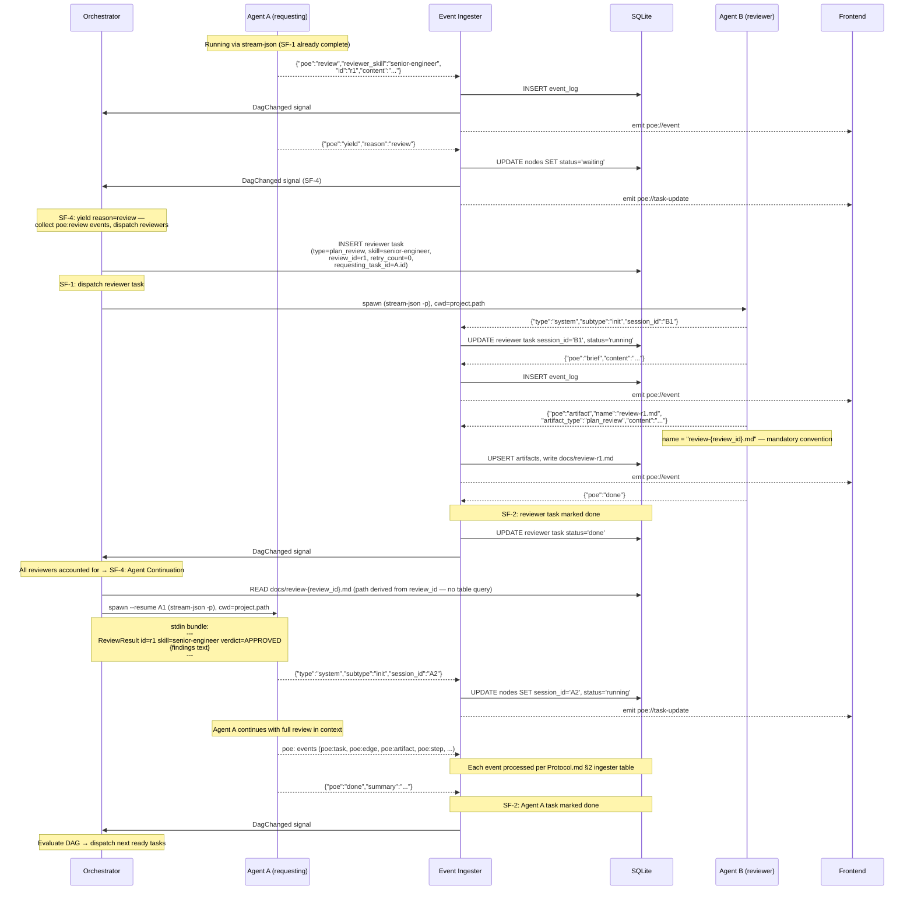

# POE — Runtime Flows

**Status**: Draft
**Last updated**: 2026-03-08

> This document specifies the dynamic execution model for POE. It answers the question the other documents do not: *in what order do things happen, and who is responsible at each step?*
>
> Static definitions — wire format, schema, event catalogue, orchestrator structure — live in `Protocol.md` and `Architecture.md`. This document references them; it does not duplicate them.

---

## 1. Overview

The runtime is built from four cooperating components. Understanding their roles is the prerequisite for reading any flow.

| Actor | Role |
|---|---|
| **Orchestrator** | Reactive scheduler. Wakes on DAG-change signals. Finds ready tasks, assembles input bundles, spawns agents. See Architecture.md §Orchestration Engine. |
| **Event Ingester** | Bridge between agent stdout and the rest of the system. Reads stream-json output, extracts `poe:` events, writes to SQLite, signals the orchestrator, emits Tauri events to the frontend. See Protocol.md §5. |
| **SQLite** | Sole source of durable state. All orchestrator decisions are made by querying it. All agent outputs land here first. |
| **Frontend** | Receives Tauri events from the ingester. Never polls. Updates the activity feed, queue panel, and task matrix in response to events. |

Agents are not actors in the orchestration sense — they are processes spawned and monitored by the orchestrator. Their only output channel is stdout (stream-json); their only input channel is stdin (the T+S+K bundle at spawn, or a `--resume` continuation).

---

## 2. Sub-Flow Reference

These sub-flows appear inside multiple primary flows. They are defined once here and referenced by name.

### SF-1: Task Dispatch

*Trigger*: Orchestrator wakes (any `DagChanged` signal) and finds a task where `status = pending` and all dependency tasks have `status = done`.

```
1. Orchestrator assembles T+S+K bundle (Protocol.md §3)
2. Orchestrator spawns: claude --output-format stream-json --verbose -p
                               --dangerously-skip-permissions [--model <id>]
   cwd = project.path
3. Bundle written to stdin; stdin closed (EOF)
4. Ingester reads first stdout event:
     {"type":"system","subtype":"init","session_id":"<uuid>"}
   → UPDATE nodes SET session_id = '<uuid>', status = 'running'
5. Orchestrator emits poe://task-update to frontend
```

### SF-2: Agent Completion

*Trigger*: Ingester receives `{"poe":"done"}` in agent stdout.

```
1. Ingester: INSERT event_log (poe:done, full payload)
2. Ingester: UPDATE nodes SET status = 'done'
3. Ingester: signal Orchestrator (DagChanged)
4. Ingester: emit poe://task-update to frontend
5. Orchestrator wakes → evaluates DAG for newly-ready tasks → runs SF-1 for each
```

### SF-3: Yield Handling

*Trigger*: Ingester receives `{"poe":"yield", "reason":"..."}` in agent stdout.

The yield event is the handoff point — the agent process is about to exit and control passes to the orchestrator. The reason field determines what the orchestrator does next.

```
1. Ingester: INSERT event_log (poe:yield, full payload)
2. Ingester: UPDATE nodes SET status = 'waiting', yield_reason = payload.reason
3. Ingester: emit poe://task-update to frontend (status change)
4. Ingester: emit poe://event to frontend (activity feed entry: "Yielded — awaiting {reason}")
5. Ingester: signal Orchestrator (DagChanged)
6. Orchestrator wakes, reads nodes.yield_reason:

   reason = "review":
     → Collect all poe:review events logged for this task (these carry id, reviewer_skill)
     → expected_ids = {event.id for each poe:review event}  ← identity set, not a count
     → For each poe:review event:
         INSERT reviewer task (type=plan_review, skill=reviewer_skill,
                               requesting_task_id=task.id,
                               review_id=event.id,       ← links back to poe:review id
                               retry_count=0)
         Dispatch via SF-1
         Spawn per-reviewer Tokio watchdog timer (default: 5 min)
     → waiting task does NOT count against concurrency limit

   Completion check (fires on reviewer status=done via SF-2, OR on watchdog cancellation):
     → answered_ids = {nodes.review_id WHERE requesting_task_id=task.id
                                         AND status IN ('done', 'cancelled')}
     → If answered_ids = expected_ids → all reviews accounted for; trigger SF-4

   Watchdog timer fires for reviewer task R:
     → R.status = done → no action (already complete)
     → R.status ≠ done AND R.retry_count < max_retry (default 2):
         UPDATE nodes SET retry_count = retry_count + 1, status = pending
         Dispatch via SF-1 (re-spawn fresh)
         Spawn new watchdog timer
     → R.status ≠ done AND R.retry_count >= max_retry:
         UPDATE nodes SET status = cancelled
         Run completion check (above) — if answered_ids = expected_ids:
             Trigger SF-4 — include failed reviewer in bundle as:
             ReviewResult id={R.review_id} skill={skill} verdict=FAILED
             {Reviewer failed to respond after max retries. Escalate via poe:decision if required.}
         Else: await remaining reviewers (they may still complete)

   reason = "decision":
     → No immediate action — orchestrator waits for human resolution
     → Resolution arrives via invoke("resolve_decision") → triggers SF-4
```

**Note**: `poe:decision` is logged by the ingester before `poe:yield` arrives. The orchestrator reads `nodes.yield_reason` (not event_log) when it processes the yield — direct column read, no join required.

### SF-4: Agent Continuation (Resume)

*Trigger*: Orchestrator determines a `waiting` task can continue — all reviewers accounted for (SF-3 review path), or human has resolved a decision (SF-3 decision path).

Distinct from SF-1: the agent process has exited but the Claude session is still valid. A new process is spawned against the existing session via `--resume`. The stdin bundle is a continuation payload, not a full T+S+K.

```
1. Orchestrator reads nodes.session_id for the waiting task
2. Orchestrator assembles continuation bundle:
     - For poe:review completion: one ReviewResult block per reviewer (Protocol.md §5)
     - For poe:decision resolution: "Human: {resolution text}"
3. Orchestrator spawns:
     claude --output-format stream-json --verbose -p
            --dangerously-skip-permissions --resume <session_id>
   cwd = project.path  ← MUST match the original session cwd (Protocol.md §5)
4. Continuation bundle written to stdin; stdin closed (EOF)
5. Ingester reads first stdout event:
     {"type":"system","subtype":"init","session_id":"<new_uuid>"}
   → UPDATE nodes SET session_id = '<new_uuid>', status = 'running'
   (new session_id overwrites prior — old value is no longer valid)
6. Ingester: emit poe://task-update to frontend
7. Agent continues from full prior session history + new bundle content
```

**Failure mode**: If `--resume` fails (session expired or cwd mismatch), Claude returns an error before emitting the init event. The orchestrator detects absence of the init event within a timeout, marks the task back to `pending`, and falls back to SF-1 (fresh spawn with full T+S+K). The fresh spawn loses prior session context but the task restarts cleanly.

| | SF-1: Task Dispatch | SF-4: Agent Continuation |
|---|---|---|
| **Spawn flag** | none | `--resume <session_id>` |
| **stdin bundle** | Full T+S+K | Continuation payload only |
| **Status transition** | `pending → running` | `waiting → running` |
| **session_id** | First write | Overwrites prior value |
| **Failure fallback** | n/a | Falls back to SF-1 |

---

## 3. Primary Flows

### 3.1 Agent-to-Agent Review (`poe:review`)

**What it is**: A running agent requests specialist peer review of its work-in-progress — a plan, an artifact, a design decision. The orchestrator routes the review automatically. The requesting agent receives the result via `--resume` and continues. No human relay required.

**Canonical use case**: The product-manager agent has drafted the phase task DAG and wants a senior-engineer to validate it for technical correctness before emitting `poe:task` events to populate the WBS.

**Wire format reference**: Protocol.md §2 (`poe:review`, `poe:yield`, `poe:artifact`, `poe:done`). Reviewer stdin bundle: Protocol.md §3 "Reviewer stdin bundle".


#### Sequence Diagram



---

#### Walkthrough

**Phase 1 — Review request**

Agent A is running autonomously. At some point during execution it determines it needs specialist input before proceeding. It emits one `poe:review` event per reviewer required (see multi-reviewer variant below), then emits `poe:yield` with `reason: "review"`.

`poe:yield` hands control back to the orchestrator — *"I have emitted all my review requests and am now yielding. Resume me when results are available."* The ingester marks the task `waiting` and triggers SF-4.

The orchestrator is woken by the `DagChanged` signal on the `poe:yield` ingestion. It reads all `poe:review` events logged for this task since it last ran, and treats them as a batch.

**Phase 2 — Reviewer dispatch**

For each `poe:review` event, the orchestrator creates a reviewer task in SQLite:
- `type = plan_review`
- `skill` = the `reviewer_skill` field from the event
- `status = pending`
- `review_id` = the `id` field from the `poe:review` event — links reviewer task back to the specific review request for ID-based completion tracking
- `retry_count = 0`
- `requesting_task_id` = Agent A's task ID (back-reference for result routing and completion checks)

A per-reviewer Tokio watchdog timer is spawned at dispatch time (default: 5 min). See SF-4 for the full watchdog logic.

Reviewer tasks are **not WBS nodes** — they do not appear in the Phase × Scope Matrix. They appear in the activity feed because they emit `poe:` events, but they are system-generated supporting tasks.

The orchestrator immediately dispatches each reviewer via SF-1. For multiple reviewers, dispatch is parallel (subject to concurrency limits).

The reviewer's stdin bundle is a modified T+S+K where the Task section identifies this as a review task and includes the review request content (Protocol.md §3 "Reviewer stdin bundle"). The reviewer receives the same artifact corpus and knowledge register as the requesting agent.

**Phase 3 — Review execution**

The reviewer runs as a standard autonomous agent. It emits `poe:brief`, produces `poe:artifact` containing its findings, and emits `poe:done`. The review artifact is written to `docs/` and indexed in SQLite like any other artifact.

The reviewer does not emit `poe:task` or `poe:edge` events — it is not planning work, it is reviewing it.

**Phase 4 — Result delivery**

When all reviewer tasks are accounted for (`answered_ids = expected_ids`), the orchestrator reads each reviewer's artifact content from disk and formats it as a `ReviewResult` block (Protocol.md §5). It then resumes the requesting agent via **SF-4: Agent Continuation**, with a bundle containing all `ReviewResult` blocks in sequence.

The requesting agent resumes with its full prior session history plus the review results. It processes the findings and continues — creating tasks, revising its plan, or escalating if the review blocked.

**Phase 5 — Continuation**

Agent A completes its work and emits final `poe:done`. The ingester marks the task `done` and the orchestrator evaluates the DAG for newly-ready tasks.

---

#### Multi-Reviewer Variant

When Agent A emits multiple `poe:review` events before `poe:yield`, the orchestrator dispatches all reviewers in parallel. The requesting agent is resumed **once** when all reviewers are complete — not once per reviewer. The resume bundle contains all `ReviewResult` blocks in sequence:

```
---
ReviewResult id=r-eng skill=senior-engineer verdict=APPROVED
{findings}
---
ReviewResult id=r-arch skill=architecture-analyst verdict=APPROVED_WITH_CONDITIONS
{findings}
---
```

Agent A receives all results simultaneously and can reason across them before proceeding.

The orchestrator tracks completion by comparing two sets:
- **expected_ids**: review IDs from all `poe:review` events emitted before `poe:yield`
- **answered_ids**: `review_id` values from reviewer tasks with `requesting_task_id = A.id` and `status = done` or `status = cancelled` (cancelled = watchdog exhausted)

When `answered_ids = expected_ids`, all reviews are accounted for — the requesting agent is resumed via SF-3 with all results, including any `verdict=FAILED` entries for watchdog-exhausted reviewers.

---

#### Key Invariants

1. **poe:yield is unambiguous**: `poe:yield` always means waiting; `poe:done` always means complete. No conditional logic required in the ingester or orchestrator. The `reason` field (`"review"` | `"decision"`) tells the orchestrator which SF-4 path to take.

2. **Batch collection**: The orchestrator collects all `poe:review` events logged since the task last ran before dispatching reviewers. An agent that emits three `poe:review` events before `poe:yield` produces three reviewers, all dispatched in parallel.

3. **Single resume**: Regardless of how many reviewers ran, the requesting agent is resumed exactly once, with all results in a single bundle. Partial delivery is not permitted.

4. **Resume mechanics via SF-4**: Result delivery uses SF-4: Agent Continuation. cwd must match the original session's cwd; the new session_id overwrites the prior one immediately. If resume fails, SF-4 falls back to SF-1 (fresh spawn). See SF-4 for the full failure mode.

5. **Reviewer tasks are not WBS nodes**: Reviewer tasks are system-generated and are excluded from the Phase × Scope Matrix. They appear in the activity feed only.

6. **Reviewer artifact is stored and delivered**: The reviewer's `poe:artifact` is written to `docs/` and indexed in SQLite (permanent record). Its content is also extracted and inlined into the resume bundle (ephemeral delivery). Both happen; neither substitutes for the other.

---

## 4. Error & Recovery Flows

*To be documented.*

---

## Appendix: Flow Index

| Flow | Section | Status |
|---|---|---|
| Agent-to-Agent Review (`poe:review`) | 3.1 | Draft |
| Project Initialisation | — | Pending |
| Task Dispatch & Completion | — | Pending |
| Decision Escalation (`poe:decision`) | — | Pending |
| Human Chat (interactive mode) | — | Pending |
| Phase Closure & Stage Gate | — | Pending |
| App Restart & Recovery | — | Pending |
